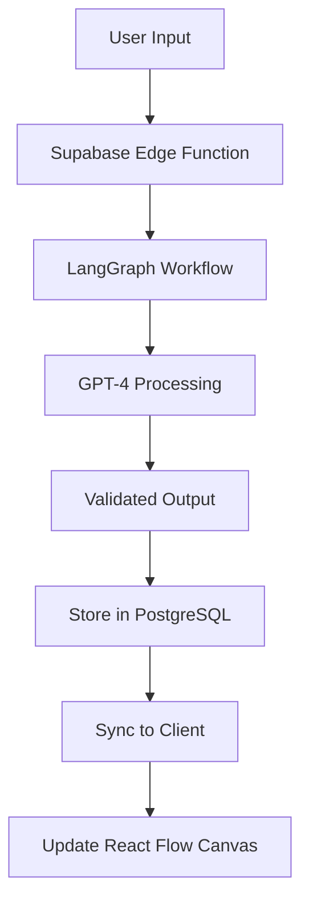

# Prob

Transform vague product ideas into fully architected, implementation-ready software projects through an AI-guided visual workflow.

<p align="center">
  
  
  
  
</p>

## Overview

GoldiDocs is a macOS desktop application that helps developers and product teams go from "I need a solution for X" to a complete technical specification with database schemas, UI components, and architectural decisions in under 30 minutes. Using an interactive canvas powered by React Flow and intelligent AI processing via LangGraph, GoldiDocs turns product ideation into actionable development plans.

## Key Features

- **🎯 Problem-First Approach**: Start with a simple description of your problem and watch as AI analyzes and validates it
- **👥 Intelligent Persona Discovery**: Automatically generates relevant user personas with pain points and needs
- **💡 Solution Mapping**: AI suggests solutions mapped to specific pain points with relevance scoring
- **📝 User Story Generation**: Creates complete user stories with acceptance criteria
- **🏗️ Technical Architecture**: Generates full technical specifications including:
  - System architecture diagrams
  - Database schemas
  - API specifications
  - UI/UX wireframes
  - Technology stack recommendations
- **🔄 Visual Workflow**: Interactive React Flow canvas for exploring and refining ideas
- **🔒 Lock & Regenerate**: Lock elements you like and regenerate others
- **📤 Export Options**: Export to Markdown, GitHub repository, or shareable links

## Technology Stack

### Desktop Framework
- **Tauri 2.x**: Native macOS performance with Rust backend
- **SQLite**: Local caching for offline functionality

### Frontend
- **React 18** with TypeScript
- **React Flow (xyflow)**: Interactive node-based canvas
- **TailwindCSS**: Atomic design system
- **Framer Motion**: Smooth animations
- **Zustand**: State management
- **React Query**: Server state management

### Backend Services
- **Supabase**: PostgreSQL database with Row Level Security
- **LangGraph**: AI orchestration in Supabase Edge Functions
- **Real-time Sync**: Collaborative features via Supabase Realtime

## Getting Started

### Prerequisites
- macOS 11.0 or later
- Node.js 18+
- Rust (for Tauri development)

### Installation

```bash
# Clone the repository
git clone https://github.com/yourusername/prob.git
cd prob

# Install dependencies
npm install

# Run in development mode
npm run tauri dev

# Build for production
npm run tauri build
```

### Environment Setup

Create a `.env` file in the root directory:

```env
VITE_SUPABASE_URL=your_supabase_url
VITE_SUPABASE_ANON_KEY=your_supabase_anon_key
```

## User Journey

### 1. Problem Input
Start by describing your problem in natural language. The AI will validate and refine it into a clear, actionable problem statement.

### 2. Persona Discovery
Watch as AI generates 5 relevant user personas, each with:
- Industry and role
- Pain levels (1-5)
- Detailed descriptions
- Lock personas you want to keep

### 3. Pain Point Analysis
Select a persona to dive deep into their specific pain points:
- Critical, High, or Medium severity
- Impact areas
- Direct connections to the persona

### 4. Solution Generation
AI proposes solutions with:
- Feature types and complexity levels
- Relevance scoring to pain points
- Visual mapping showing connections
- Multi-select for your tech stack

### 5. Technical Specification
Generate comprehensive documentation:
- User stories with acceptance criteria
- System architecture
- Database schemas
- UI screen specifications
- API endpoints

### 6. Export & Implement
Export your project as:
- Markdown documentation
- GitHub repository with initial code
- Shareable link for team collaboration

## Architecture

### Canvas-First Design
Unlike traditional wizards, GoldiDocs uses a single continuous canvas where nodes appear and transform based on workflow state, providing seamless transitions and spatial context.

### Event Sourcing
Every change is stored as an immutable event, enabling:
- Complete history tracking
- Time travel to any previous state
- Branching explorations
- Team collaboration

### AI Processing Pipeline


## Development

### Project Structure
```
src/
├── components/        # Reusable UI components
│   ├── canvas/       # React Flow nodes and edges
│   ├── layout/       # Sidebar, ProgressBar
│   └── workflow/     # Step-specific components
├── hooks/            # Custom React hooks
├── services/         # API and external services
├── stores/           # Zustand state management
├── types/            # TypeScript definitions
└── utils/            # Helper functions
```

### Key Commands

```bash
# Development
npm run dev           # Start Vite dev server
npm run tauri dev     # Start Tauri in dev mode

# Testing
npm run test          # Run unit tests
npm run test:e2e      # Run end-to-end tests

# Building
npm run build         # Build for production
npm run tauri build   # Build Tauri app

# Code Quality
npm run lint          # Run ESLint
npm run typecheck     # Run TypeScript checks
```

## Roadmap

- [ ] Windows and Linux support
- [ ] Real-time collaboration features
- [ ] Plugin system for custom nodes
- [ ] AI model selection (GPT-4, Claude, etc.)
- [ ] Version control integration
- [ ] Custom workflow templates
- [ ] Export to Figma/design tools

## Contributing

We welcome contributions! Please see our [Contributing Guide](CONTRIBUTING.md) for details.

## License

This project is licensed under the MIT License - see the [LICENSE](LICENSE) file for details.

## Acknowledgments

- Built with [Tauri](https://tauri.app/)
- Canvas powered by [React Flow](https://reactflow.dev/)
- AI orchestration via [LangGraph](https://github.com/langchain-ai/langgraph)
- Database by [Supabase](https://supabase.com/)
