# GoldiDocs - Data Flow Diagram with Local Storage

## Overview

This document illustrates the complete data flow architecture for Prob, incorporating local SQLite storage with consistency mechanisms, Supabase cloud synchronization, and the React Flow canvas visualization layer.

## High-Level Architecture

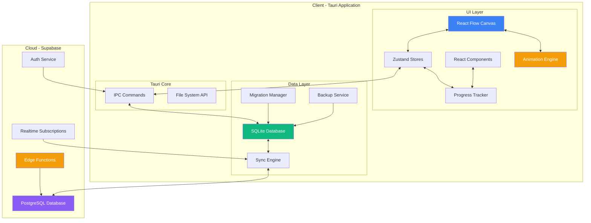
```mermaid
graph TB
    subgraph "Client - Tauri Application"
        subgraph "UI Layer"
            A[React Flow Canvas]
            B[Zustand Stores]
            C[React Components]
            N[Animation Engine]
            O[Progress Tracker]
        end
        
        subgraph "Data Layer"
            D[SQLite Database]
            E[Sync Engine]
            F[Migration Manager]
            G[Backup Service]
        end
        
        subgraph "Tauri Core"
            H[IPC Commands]
            I[File System API]
        end
    end
    
    subgraph "Cloud - Supabase"
        J[PostgreSQL Database]
        K[Edge Functions]
        L[Realtime Subscriptions]
        M[Auth Service]
    end
    
    A <--> B
    A <--> N
    B <--> H
    B <--> O
    C <--> O
    H <--> D
    D <--> E
    E <--> J
    K --> J
    L --> E
    F --> D
    G --> D
    M --> H
    
    style A fill:#3b82f6,color:#fff
    style D fill:#10b981,color:#fff
    style J fill:#8b5cf6,color:#fff
    style K fill:#f59e0b,color:#fff
    style N fill:#f59e0b,color:#fff
```

## Detailed Data Flow Sequences

### 1. Application Startup Flow

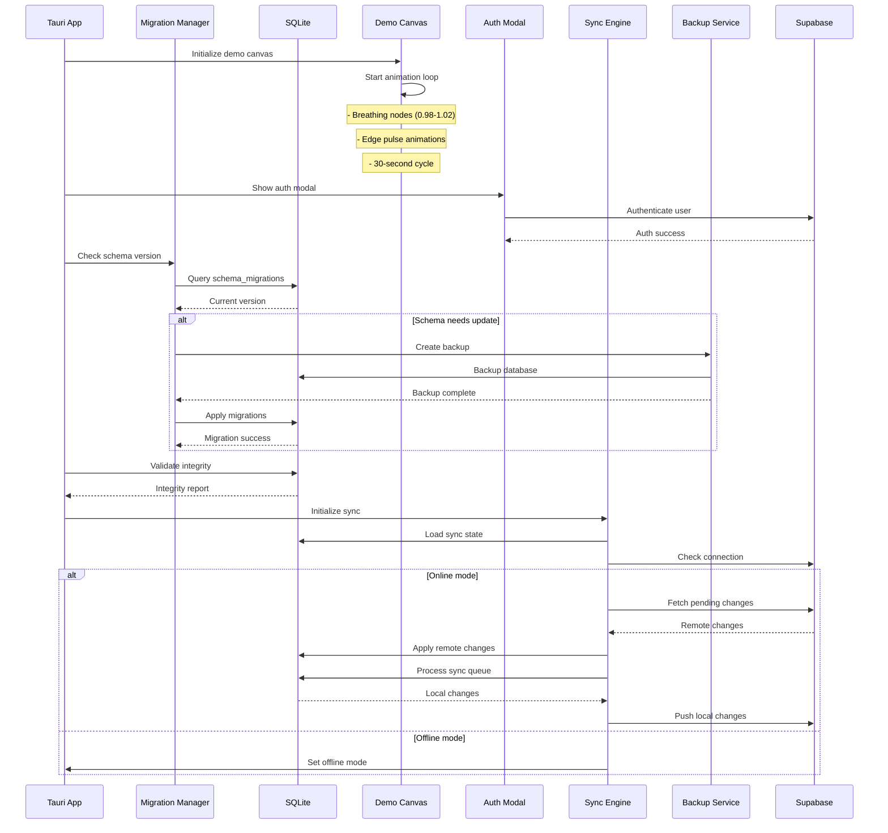
```mermaid
sequenceDiagram
    participant App as Tauri App
    participant MM as Migration Manager
    participant DB as SQLite
    participant Demo as Demo Canvas
    participant Auth as Auth Modal
    participant Sync as Sync Engine
    participant Backup as Backup Service
    participant Supa as Supabase
    
    App->>Demo: Initialize demo canvas
    Demo->>Demo: Start animation loop
    Note over Demo: - Breathing nodes (0.98-1.02)
    Note over Demo: - Edge pulse animations
    Note over Demo: - 30-second cycle
    
    App->>Auth: Show auth modal
    Auth->>Supa: Authenticate user
    Supa-->>Auth: Auth success
    
    App->>MM: Check schema version
    MM->>DB: Query schema_migrations
    DB-->>MM: Current version
    
    alt Schema needs update
        MM->>Backup: Create backup
        Backup->>DB: Backup database
        Backup-->>MM: Backup complete
        MM->>DB: Apply migrations
        DB-->>MM: Migration success
    end
    
    App->>DB: Validate integrity
    DB-->>App: Integrity report
    
    App->>Sync: Initialize sync
    Sync->>DB: Load sync state
    Sync->>Supa: Check connection
    
    alt Online mode
        Sync->>Supa: Fetch pending changes
        Supa-->>Sync: Remote changes
        Sync->>DB: Apply remote changes
        Sync->>DB: Process sync queue
        DB-->>Sync: Local changes
        Sync->>Supa: Push local changes
    else Offline mode
        Sync->>App: Set offline mode
    end
```

### 2. Problem Input & Validation Flow

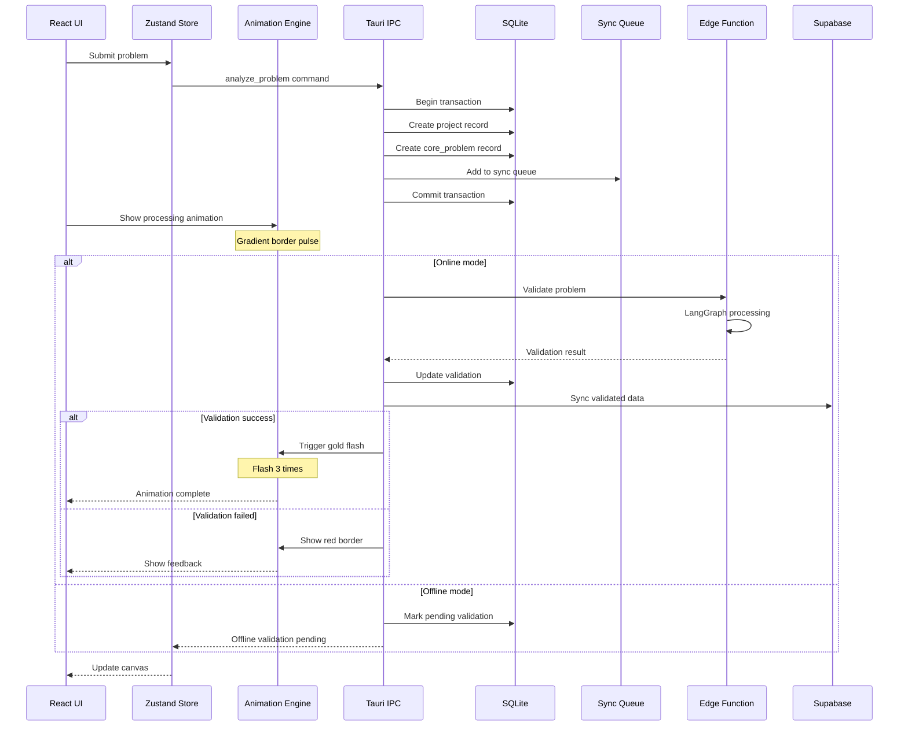
```mermaid
sequenceDiagram
    participant UI as React UI
    participant Store as Zustand Store
    participant Anim as Animation Engine
    participant IPC as Tauri IPC
    participant DB as SQLite
    participant Queue as Sync Queue
    participant Edge as Edge Function
    participant Supa as Supabase
    
    UI->>Store: Submit problem
    Store->>IPC: analyze_problem command
    
    IPC->>DB: Begin transaction
    IPC->>DB: Create project record
    IPC->>DB: Create core_problem record
    IPC->>Queue: Add to sync queue
    IPC->>DB: Commit transaction
    
    UI->>Anim: Show processing animation
    Note over Anim: Gradient border pulse
    
    alt Online mode
        IPC->>Edge: Validate problem
        Edge->>Edge: LangGraph processing
        Edge-->>IPC: Validation result
        IPC->>DB: Update validation
        IPC->>Supa: Sync validated data
        
        alt Validation success
            IPC->>Anim: Trigger gold flash
            Note over Anim: Flash 3 times
            Anim-->>UI: Animation complete
        else Validation failed
            IPC->>Anim: Show red border
            Anim-->>UI: Show feedback
        end
    else Offline mode
        IPC->>DB: Mark pending validation
        IPC-->>Store: Offline validation pending
    end
    
    Store-->>UI: Update canvas
```

### 3. Persona Generation with Locking

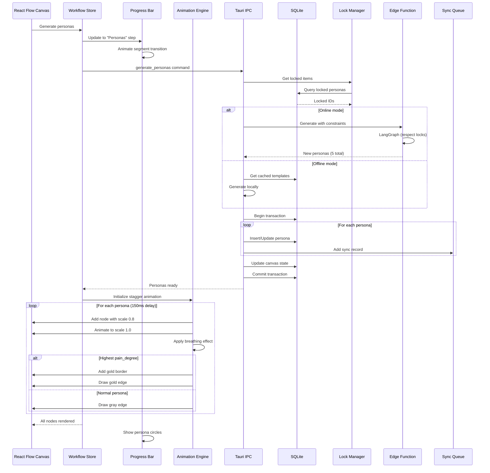
```mermaid
sequenceDiagram
    participant Canvas as React Flow Canvas
    participant Store as Workflow Store
    participant Progress as Progress Bar
    participant Anim as Animation Engine
    participant IPC as Tauri IPC
    participant DB as SQLite
    participant Lock as Lock Manager
    participant Edge as Edge Function
    participant Queue as Sync Queue
    
    Canvas->>Store: Generate personas
    Store->>Progress: Update to "Personas" step
    Progress->>Progress: Animate segment transition
    
    Store->>IPC: generate_personas command
    
    IPC->>Lock: Get locked items
    Lock->>DB: Query locked personas
    DB-->>Lock: Locked IDs
    
    alt Online mode
        IPC->>Edge: Generate with constraints
        Edge->>Edge: LangGraph (respect locks)
        Edge-->>IPC: New personas (5 total)
    else Offline mode
        IPC->>DB: Get cached templates
        IPC->>IPC: Generate locally
    end
    
    IPC->>DB: Begin transaction
    loop For each persona
        IPC->>DB: Insert/Update persona
        IPC->>Queue: Add sync record
    end
    IPC->>DB: Update canvas state
    IPC->>DB: Commit transaction
    
    IPC-->>Store: Personas ready
    Store->>Anim: Initialize stagger animation
    
    loop For each persona (150ms delay)
        Anim->>Canvas: Add node with scale 0.8
        Anim->>Canvas: Animate to scale 1.0
        Anim->>Anim: Apply breathing effect
        
        alt Highest pain_degree
            Anim->>Canvas: Add gold border
            Anim->>Canvas: Draw gold edge
        else Normal persona
            Anim->>Canvas: Draw gray edge
        end
    end
    
    Store-->>Canvas: All nodes rendered
    Progress->>Progress: Show persona circles
```

### 4. Synchronization Flow

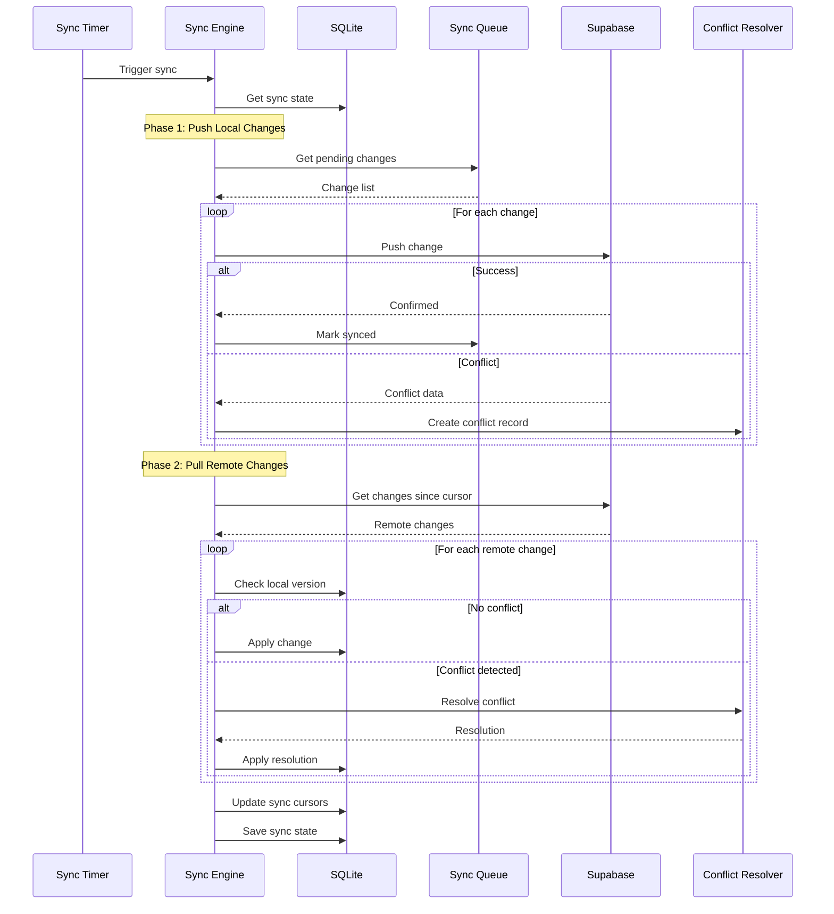
```mermaid
sequenceDiagram
    participant Timer as Sync Timer
    participant Engine as Sync Engine
    participant DB as SQLite
    participant Queue as Sync Queue
    participant Supa as Supabase
    participant Conflict as Conflict Resolver
    
    Timer->>Engine: Trigger sync
    Engine->>DB: Get sync state
    
    Note over Engine: Phase 1: Push Local Changes
    Engine->>Queue: Get pending changes
    Queue-->>Engine: Change list
    
    loop For each change
        Engine->>Supa: Push change
        alt Success
            Supa-->>Engine: Confirmed
            Engine->>Queue: Mark synced
        else Conflict
            Supa-->>Engine: Conflict data
            Engine->>Conflict: Create conflict record
        end
    end
    
    Note over Engine: Phase 2: Pull Remote Changes
    Engine->>Supa: Get changes since cursor
    Supa-->>Engine: Remote changes
    
    loop For each remote change
        Engine->>DB: Check local version
        alt No conflict
            Engine->>DB: Apply change
        else Conflict detected
            Engine->>Conflict: Resolve conflict
            Conflict-->>Engine: Resolution
            Engine->>DB: Apply resolution
        end
    end
    
    Engine->>DB: Update sync cursors
    Engine->>DB: Save sync state
```

### 5. Conflict Resolution Flow

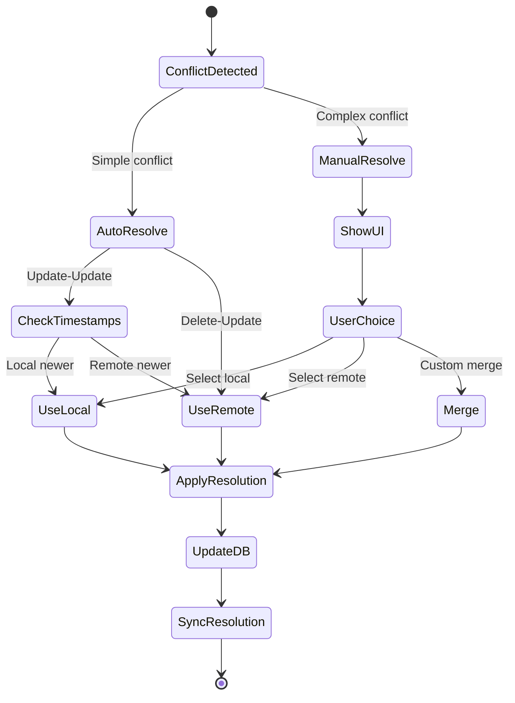
```mermaid
stateDiagram-v2
    [*] --> ConflictDetected
    ConflictDetected --> AutoResolve: Simple conflict
    ConflictDetected --> ManualResolve: Complex conflict
    
    AutoResolve --> CheckTimestamps: Update-Update
    AutoResolve --> UseRemote: Delete-Update
    
    CheckTimestamps --> UseLocal: Local newer
    CheckTimestamps --> UseRemote: Remote newer
    
    ManualResolve --> ShowUI
    ShowUI --> UserChoice
    UserChoice --> UseLocal: Select local
    UserChoice --> UseRemote: Select remote
    UserChoice --> Merge: Custom merge
    
    UseLocal --> ApplyResolution
    UseRemote --> ApplyResolution
    Merge --> ApplyResolution
    
    ApplyResolution --> UpdateDB
    UpdateDB --> SyncResolution
    SyncResolution --> [*]
```

### 6. Canvas State Management Flow

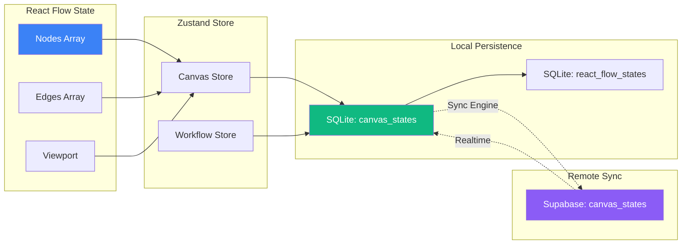
```mermaid
graph LR
    subgraph "React Flow State"
        A[Nodes Array]
        B[Edges Array]
        C[Viewport]
    end
    
    subgraph "Zustand Store"
        D[Canvas Store]
        E[Workflow Store]
    end
    
    subgraph "Local Persistence"
        F[SQLite: canvas_states]
        G[SQLite: react_flow_states]
    end
    
    subgraph "Remote Sync"
        H[Supabase: canvas_states]
    end
    
    A --> D
    B --> D
    C --> D
    D --> F
    E --> F
    F --> G
    
    F -.->|Sync Engine| H
    H -.->|Realtime| F
    
    style A fill:#3b82f6,color:#fff
    style F fill:#10b981,color:#fff
    style H fill:#8b5cf6,color:#fff
```

### 7. Document Generation Pipeline

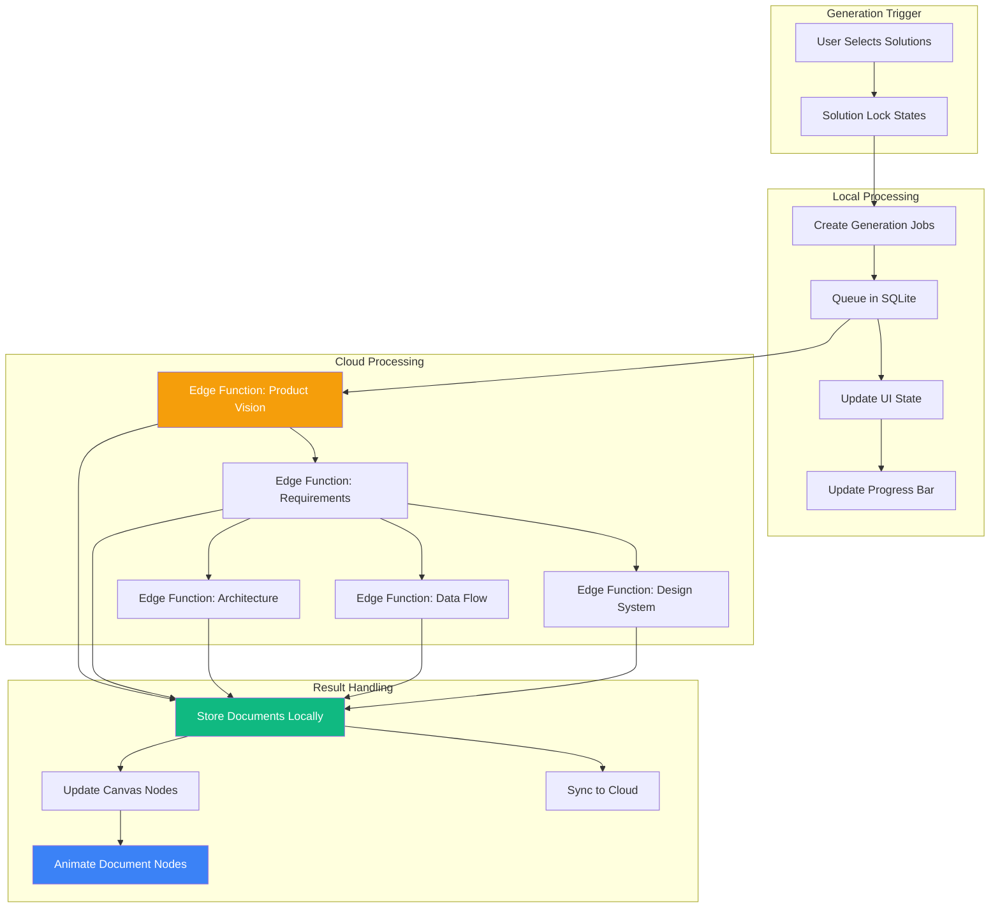
```mermaid
graph TD
    subgraph "Generation Trigger"
        A[User Selects Solutions]
        AA[Solution Lock States]
    end
    
    subgraph "Local Processing"
        B[Create Generation Jobs]
        C[Queue in SQLite]
        D[Update UI State]
        BB[Update Progress Bar]
    end
    
    subgraph "Cloud Processing"
        E[Edge Function: Product Vision]
        F[Edge Function: Requirements]
        G[Edge Function: Architecture]
        H[Edge Function: Data Flow]
        I[Edge Function: Design System]
    end
    
    subgraph "Result Handling"
        J[Store Documents Locally]
        K[Update Canvas Nodes]
        L[Sync to Cloud]
        KK[Animate Document Nodes]
    end
    
    A --> AA
    AA --> B
    B --> C
    C --> D
    D --> BB
    
    C --> E
    E --> F
    F --> G
    F --> H
    F --> I
    
    E --> J
    F --> J
    G --> J
    H --> J
    I --> J
    
    J --> K
    K --> KK
    J --> L
    
    style E fill:#f59e0b,color:#fff
    style J fill:#10b981,color:#fff
    style KK fill:#3b82f6,color:#fff
```

### 8. Backup and Recovery Flow

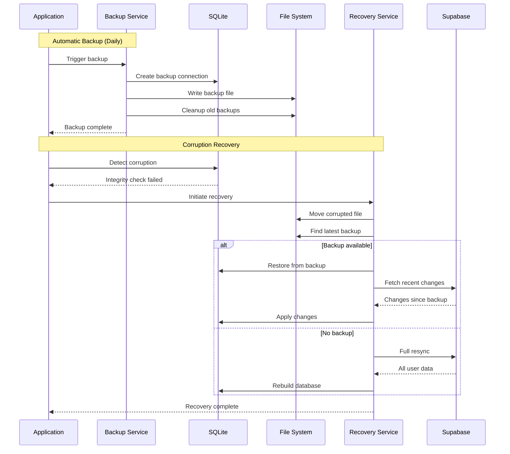
```mermaid
sequenceDiagram
    participant App as Application
    participant Backup as Backup Service
    participant DB as SQLite
    participant FS as File System
    participant Recovery as Recovery Service
    participant Supa as Supabase
    
    Note over App,Backup: Automatic Backup (Daily)
    App->>Backup: Trigger backup
    Backup->>DB: Create backup connection
    Backup->>FS: Write backup file
    Backup->>FS: Cleanup old backups
    Backup-->>App: Backup complete
    
    Note over App,Recovery: Corruption Recovery
    App->>DB: Detect corruption
    DB-->>App: Integrity check failed
    App->>Recovery: Initiate recovery
    Recovery->>FS: Move corrupted file
    Recovery->>FS: Find latest backup
    
    alt Backup available
        Recovery->>DB: Restore from backup
        Recovery->>Supa: Fetch recent changes
        Supa-->>Recovery: Changes since backup
        Recovery->>DB: Apply changes
    else No backup
        Recovery->>Supa: Full resync
        Supa-->>Recovery: All user data
        Recovery->>DB: Rebuild database
    end
    
    Recovery-->>App: Recovery complete
```

## Data Consistency Guarantees

### 1. Transaction Boundaries

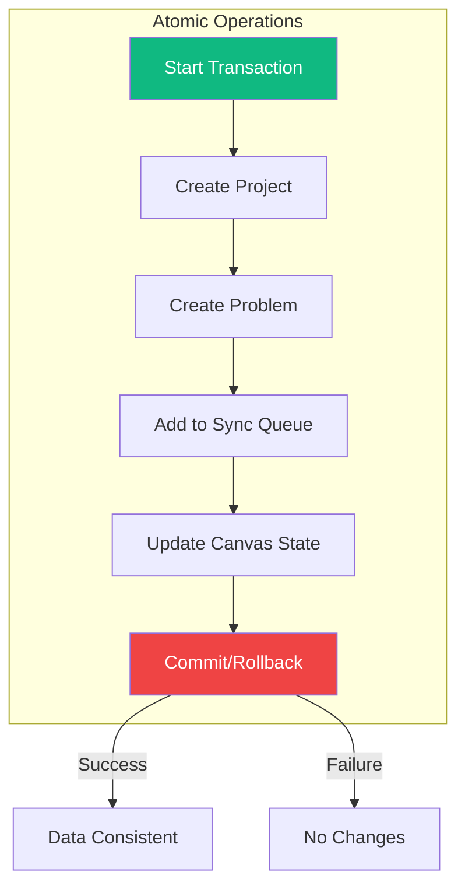
```mermaid
graph TD
    subgraph "Atomic Operations"
        A[Start Transaction]
        B[Create Project]
        C[Create Problem]
        D[Add to Sync Queue]
        E[Update Canvas State]
        F[Commit/Rollback]
    end
    
    A --> B
    B --> C
    C --> D
    D --> E
    E --> F
    
    F -->|Success| G[Data Consistent]
    F -->|Failure| H[No Changes]
    
    style A fill:#10b981,color:#fff
    style F fill:#ef4444,color:#fff
```

### 2. Version Control Flow

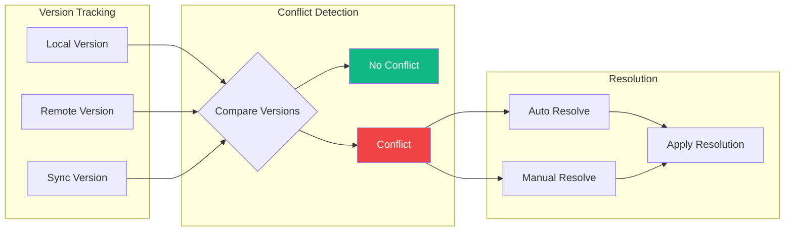
```mermaid
graph LR
    subgraph "Version Tracking"
        A[Local Version]
        B[Remote Version]
        C[Sync Version]
    end
    
    subgraph "Conflict Detection"
        D{Compare Versions}
        E[No Conflict]
        F[Conflict]
    end
    
    subgraph "Resolution"
        G[Auto Resolve]
        H[Manual Resolve]
        I[Apply Resolution]
    end
    
    A --> D
    B --> D
    C --> D
    
    D --> E
    D --> F
    
    F --> G
    F --> H
    G --> I
    H --> I
    
    style F fill:#ef4444,color:#fff
    style E fill:#10b981,color:#fff
```

## Error Handling Flows

### 1. Network Failure Handling

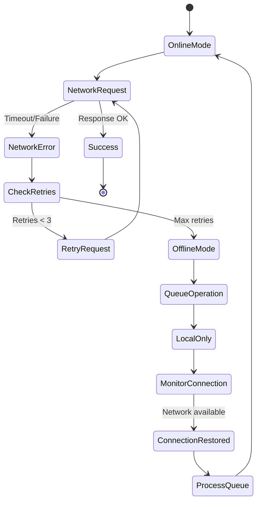
```mermaid
stateDiagram-v2
    [*] --> OnlineMode
    OnlineMode --> NetworkRequest
    NetworkRequest --> Success: Response OK
    NetworkRequest --> NetworkError: Timeout/Failure
    
    NetworkError --> CheckRetries
    CheckRetries --> RetryRequest: Retries < 3
    CheckRetries --> OfflineMode: Max retries
    
    RetryRequest --> NetworkRequest
    
    OfflineMode --> QueueOperation
    QueueOperation --> LocalOnly
    LocalOnly --> MonitorConnection
    
    MonitorConnection --> ConnectionRestored: Network available
    ConnectionRestored --> ProcessQueue
    ProcessQueue --> OnlineMode
    
    Success --> [*]
```

### 2. Migration Failure Recovery

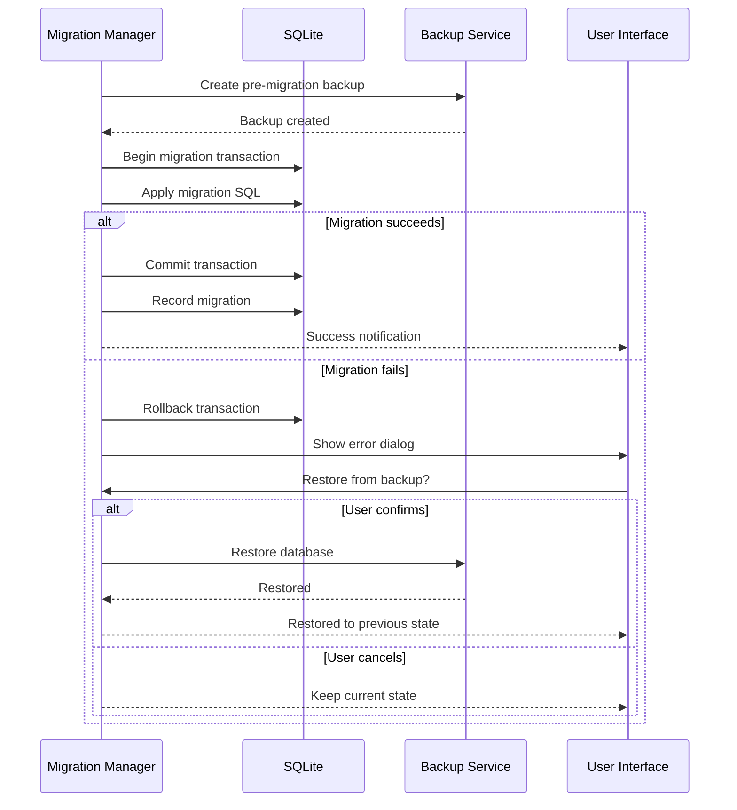
```mermaid
sequenceDiagram
    participant MM as Migration Manager
    participant DB as SQLite
    participant Backup as Backup Service
    participant User as User Interface
    
    MM->>Backup: Create pre-migration backup
    Backup-->>MM: Backup created
    
    MM->>DB: Begin migration transaction
    MM->>DB: Apply migration SQL
    
    alt Migration succeeds
        MM->>DB: Commit transaction
        MM->>DB: Record migration
        MM-->>User: Success notification
    else Migration fails
        MM->>DB: Rollback transaction
        MM->>User: Show error dialog
        User->>MM: Restore from backup?
        
        alt User confirms
            MM->>Backup: Restore database
            Backup-->>MM: Restored
            MM-->>User: Restored to previous state
        else User cancels
            MM-->>User: Keep current state
        end
    end
```

## Canvas Animation & Interaction Flows

### 1. Animation State Management

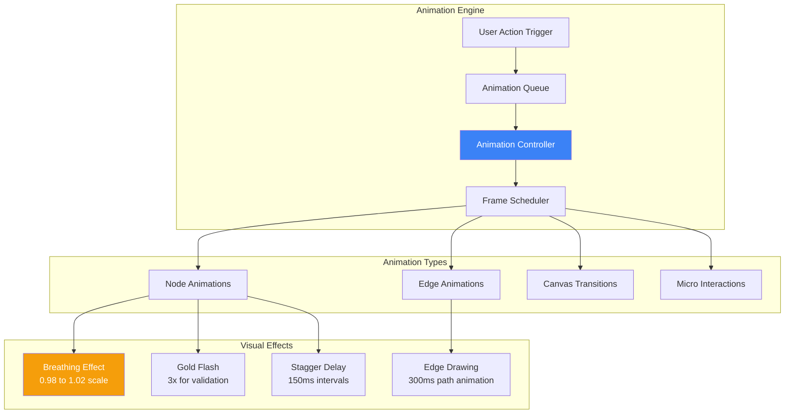
```mermaid
graph TD
    subgraph "Animation Engine"
        A[User Action Trigger]
        B[Animation Queue]
        C[Animation Controller]
        D[Frame Scheduler]
    end
    
    subgraph "Animation Types"
        E[Node Animations]
        F[Edge Animations]
        G[Canvas Transitions]
        H[Micro Interactions]
    end
    
    subgraph "Visual Effects"
        I[Breathing Effect<br/>0.98 to 1.02 scale]
        J[Gold Flash<br/>3x for validation]
        K[Stagger Delay<br/>150ms intervals]
        L[Edge Drawing<br/>300ms path animation]
    end
    
    A --> B
    B --> C
    C --> D
    D --> E
    D --> F
    D --> G
    D --> H
    
    E --> I
    E --> J
    E --> K
    F --> L
    
    style C fill:#3b82f6,color:#fff
    style I fill:#f59e0b,color:#fff
```

### 2. Progress Bar State Flow

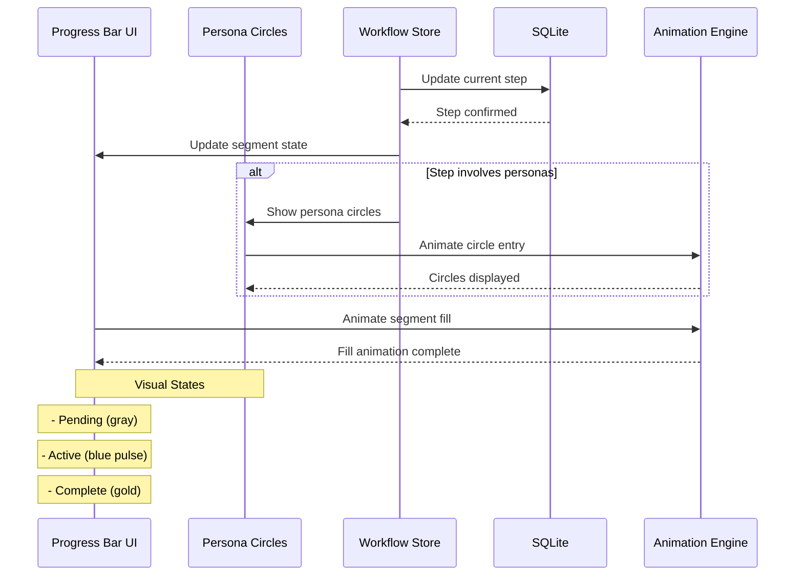
```mermaid
sequenceDiagram
    participant UI as Progress Bar UI
    participant PC as Persona Circles
    participant Store as Workflow Store
    participant DB as SQLite
    participant Anim as Animation Engine
    
    Store->>DB: Update current step
    DB-->>Store: Step confirmed
    Store->>UI: Update segment state
    
    alt Step involves personas
        Store->>PC: Show persona circles
        PC->>Anim: Animate circle entry
        Anim-->>PC: Circles displayed
    end
    
    UI->>Anim: Animate segment fill
    Anim-->>UI: Fill animation complete
    
    Note over UI,PC: Visual States
    Note over UI: - Pending (gray)
    Note over UI: - Active (blue pulse)
    Note over UI: - Complete (gold)
```

### 3. Canvas Layout Transition Flow

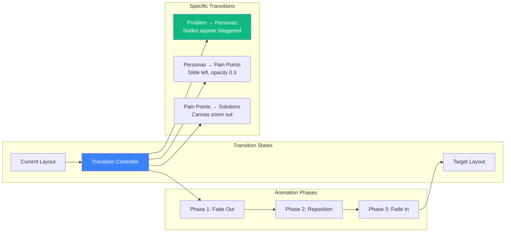
```mermaid
graph LR
    subgraph "Transition States"
        A[Current Layout]
        B[Transition Controller]
        C[Target Layout]
    end
    
    subgraph "Animation Phases"
        D[Phase 1: Fade Out]
        E[Phase 2: Reposition]
        F[Phase 3: Fade In]
    end
    
    subgraph "Specific Transitions"
        G[Problem → Personas<br/>Nodes appear staggered]
        H[Personas → Pain Points<br/>Slide left, opacity 0.3]
        I[Pain Points → Solutions<br/>Canvas zoom out]
    end
    
    A --> B
    B --> D
    D --> E
    E --> F
    F --> C
    
    B --> G
    B --> H
    B --> I
    
    style B fill:#3b82f6,color:#fff
    style G fill:#10b981,color:#fff
```

### 4. Interactive Selection State Management

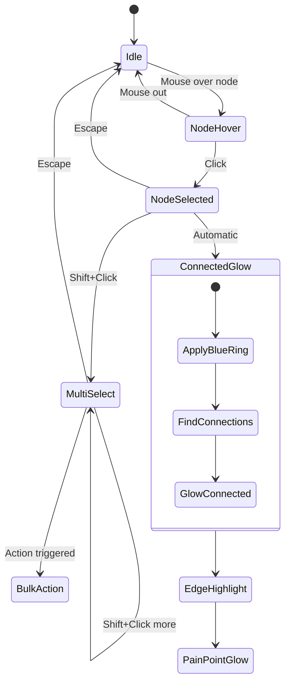
```mermaid
stateDiagram-v2
    [*] --> Idle
    
    Idle --> NodeHover: Mouse over node
    NodeHover --> NodeSelected: Click
    NodeHover --> Idle: Mouse out
    
    NodeSelected --> MultiSelect: Shift+Click
    NodeSelected --> ConnectedGlow: Automatic
    NodeSelected --> Idle: Escape
    
    MultiSelect --> MultiSelect: Shift+Click more
    MultiSelect --> BulkAction: Action triggered
    MultiSelect --> Idle: Escape
    
    ConnectedGlow --> EdgeHighlight
    EdgeHighlight --> PainPointGlow
    
    state ConnectedGlow {
        [*] --> ApplyBlueRing
        ApplyBlueRing --> FindConnections
        FindConnections --> GlowConnected
    }
```

### 5. Recent Problem Flows Query

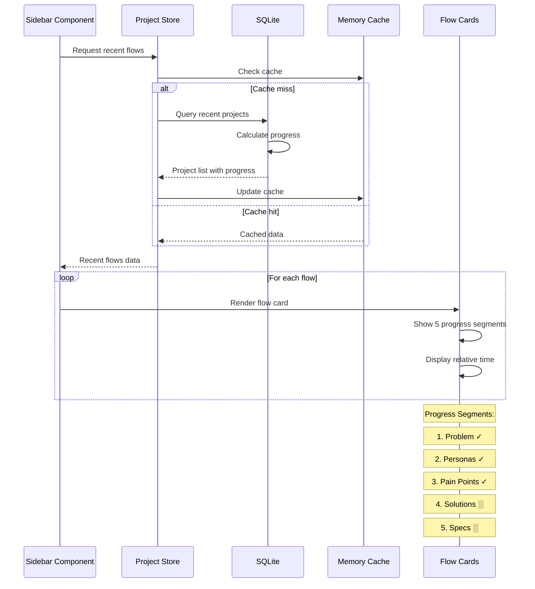
```mermaid
sequenceDiagram
    participant Sidebar as Sidebar Component
    participant Store as Project Store
    participant DB as SQLite
    participant Cache as Memory Cache
    participant UI as Flow Cards
    
    Sidebar->>Store: Request recent flows
    Store->>Cache: Check cache
    
    alt Cache miss
        Store->>DB: Query recent projects
        DB->>DB: Calculate progress
        DB-->>Store: Project list with progress
        Store->>Cache: Update cache
    else Cache hit
        Cache-->>Store: Cached data
    end
    
    Store-->>Sidebar: Recent flows data
    
    loop For each flow
        Sidebar->>UI: Render flow card
        UI->>UI: Show 5 progress segments
        UI->>UI: Display relative time
    end
    
    Note over UI: Progress Segments:
    Note over UI: 1. Problem ✓
    Note over UI: 2. Personas ✓
    Note over UI: 3. Pain Points ✓
    Note over UI: 4. Solutions ░
    Note over UI: 5. Specs ░
```

## Export System Flows

### 1. Export Format Generation

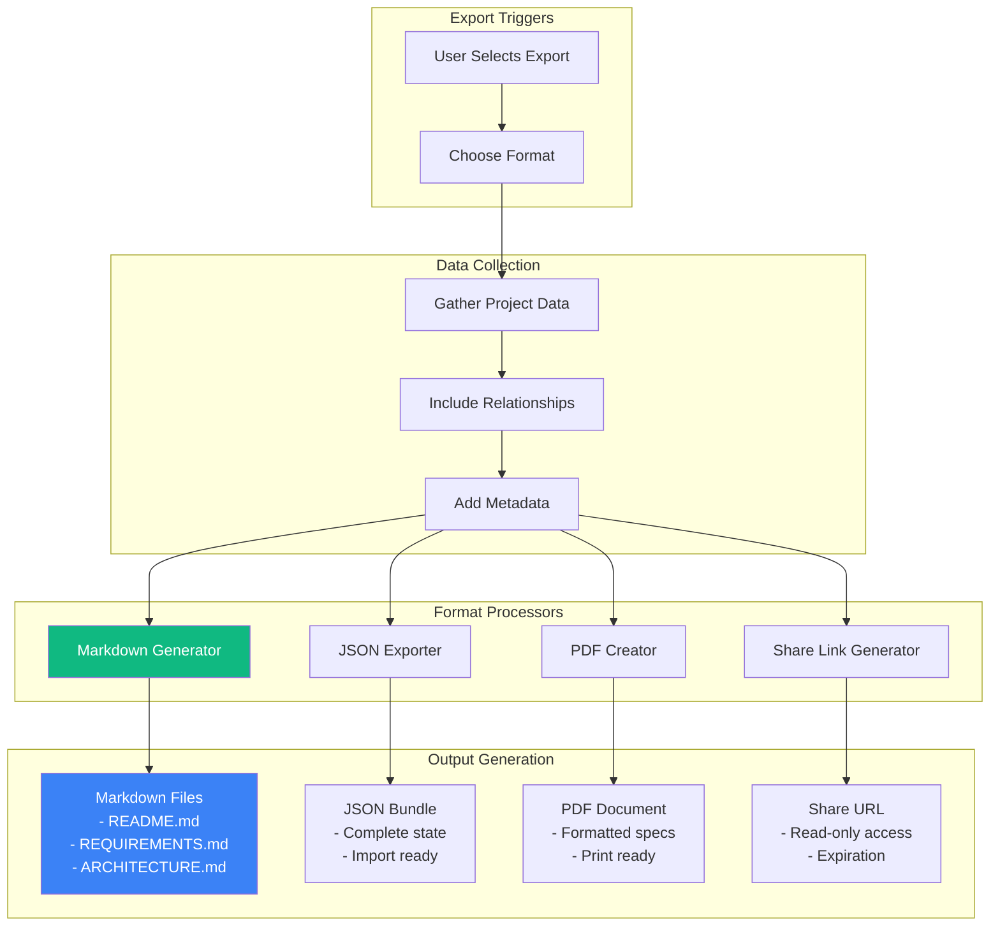
```mermaid
graph TD
    subgraph "Export Triggers"
        A[User Selects Export]
        B[Choose Format]
    end
    
    subgraph "Format Processors"
        C[Markdown Generator]
        D[JSON Exporter]
        E[PDF Creator]
        F[Share Link Generator]
    end
    
    subgraph "Data Collection"
        G[Gather Project Data]
        H[Include Relationships]
        I[Add Metadata]
    end
    
    subgraph "Output Generation"
        J[Markdown Files<br/>- README.md<br/>- REQUIREMENTS.md<br/>- ARCHITECTURE.md]
        K[JSON Bundle<br/>- Complete state<br/>- Import ready]
        L[PDF Document<br/>- Formatted specs<br/>- Print ready]
        M[Share URL<br/>- Read-only access<br/>- Expiration]
    end
    
    A --> B
    B --> G
    G --> H
    H --> I
    
    I --> C --> J
    I --> D --> K
    I --> E --> L
    I --> F --> M
    
    style C fill:#10b981,color:#fff
    style J fill:#3b82f6,color:#fff
```

### 2. Share Link Access Flow

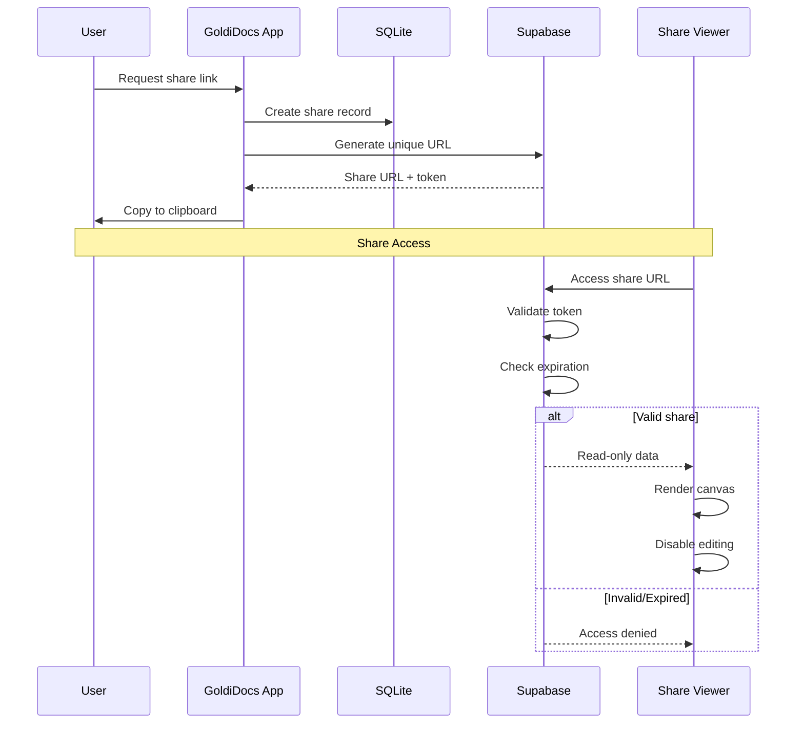
```mermaid
sequenceDiagram
    participant User as User
    participant App as GoldiDocs App
    participant DB as SQLite
    participant Supa as Supabase
    participant Viewer as Share Viewer
    
    User->>App: Request share link
    App->>DB: Create share record
    App->>Supa: Generate unique URL
    Supa-->>App: Share URL + token
    App->>User: Copy to clipboard
    
    Note over User,Viewer: Share Access
    
    Viewer->>Supa: Access share URL
    Supa->>Supa: Validate token
    Supa->>Supa: Check expiration
    
    alt Valid share
        Supa-->>Viewer: Read-only data
        Viewer->>Viewer: Render canvas
        Viewer->>Viewer: Disable editing
    else Invalid/Expired
        Supa-->>Viewer: Access denied
    end
```

## Performance Optimization Strategies

### 1. Batch Operations

```mermaid
graph TD
    subgraph "Individual Operations"
        A1[Update 1]
        A2[Update 2]
        A3[Update 3]
        A4[Update N]
    end
    
    subgraph "Batch Processing"
        B[Collect Updates]
        C[Single Transaction]
        D[Bulk Insert/Update]
        E[One Sync Record]
    end
    
    A1 --> B
    A2 --> B
    A3 --> B
    A4 --> B
    
    B --> C
    C --> D
    D --> E
    
    style B fill:#3b82f6,color:#fff
    style D fill:#10b981,color:#fff
```

### 2. Caching Strategy

```mermaid
graph LR
    subgraph "Cache Layers"
        A[UI State Cache]
        B[SQLite Cache]
        C[Memory Cache]
    end
    
    subgraph "Data Sources"
        D[Local SQLite]
        E[Remote Supabase]
    end
    
    A -->|Read| C
    C -->|Miss| B
    B -->|Miss| D
    D -->|Sync| E
    
    E -->|Update| D
    D -->|Invalidate| B
    B -->|Invalidate| C
    C -->|Update| A
    
    style C fill:#fbbf24,color:#000
    style D fill:#10b981,color:#fff
```

## Security Considerations

### 1. Data Encryption Flow

```mermaid
graph TD
    subgraph "Local Storage"
        A[User Data]
        B[Encryption Key]
        C[Encrypted SQLite]
    end
    
    subgraph "Key Management"
        D[Keychain/Credential Store]
        E[Derived Key]
    end
    
    subgraph "Sync Security"
        F[TLS Connection]
        G[Auth Token]
        H[Supabase RLS]
    end
    
    A --> B
    B --> C
    D --> E
    E --> B
    
    C -->|Sync| F
    G --> F
    F --> H
    
    style C fill:#ef4444,color:#fff
    style F fill:#10b981,color:#fff
```

## Monitoring and Diagnostics

### 1. Health Check Flow

```mermaid
graph TD
    subgraph "Health Monitors"
        A[Database Size Monitor]
        B[Sync Queue Monitor]
        C[Conflict Monitor]
        D[Performance Monitor]
    end
    
    subgraph "Metrics"
        E[Storage Usage]
        F[Pending Syncs]
        G[Active Conflicts]
        H[Operation Latency]
    end
    
    subgraph "Alerts"
        I[Storage Warning]
        J[Sync Backlog]
        K[Conflict Count]
        L[Performance Degradation]
    end
    
    A --> E --> I
    B --> F --> J
    C --> G --> K
    D --> H --> L
    
    style I fill:#f59e0b,color:#fff
    style J fill:#ef4444,color:#fff
```

This comprehensive data flow diagram incorporates all aspects of local storage consistency, synchronization, error handling, and performance optimization to ensure a robust and reliable application architecture.