# GoldiDocs - Product Vision Document

## Executive Summary

GoldiDocs is a macOS desktop application that transforms vague product ideas into fully architected, implementation-ready software projects through an AI-guided visual workflow. Built with Tauri, React Flow, and powered by LangGraph AI orchestration via Supabase Edge Functions, GoldiDocs enables developers and product teams to go from "I need a solution for X" to comprehensive technical specifications including product vision, functional requirements, system architecture, data flows, database schemas, and design systems—all within a visually intuitive canvas interface.

## Core Value Proposition

**For**: Product managers, developers, and startup founders who struggle to translate ideas into actionable technical specifications

**GoldiDocs is**: An AI-powered visual workflow tool that systematically transforms problems into complete software architectures

**Unlike**: Traditional planning tools that require manual specification writing or disconnected AI assistants

**Prob**: Provides an interactive, node-based canvas that visualizes the entire journey from problem to solution, with AI generating each step while maintaining full version control and user agency through selective locking and regeneration

## Technical Architecture

### Frontend Stack
- **Desktop Framework**: Tauri 2.x (Rust backend + Web frontend)
- **UI Framework**: React 18 with TypeScript
- **Canvas Engine**: React Flow (xyflow) for node-based interactions
- **State Management**: Zustand for global state, React Query for server state
- **Styling**: TailwindCSS with custom atomic design system
- **Animations**: Framer Motion for smooth transitions

### Backend Infrastructure
- **Cloud Database**: Supabase (PostgreSQL) with Row Level Security
- **AI Orchestration**: LangGraph running in Supabase Edge Functions
- **Local Storage**: SQLite for offline caching and performance
- **Real-time Sync**: Supabase Realtime for collaborative features
- **Version Control**: Event sourcing architecture for complete state history

## Detailed User Journey

### User Journey 1: Onboarding & Welcome Flow

#### Scene Setting
Sarah, a product manager at a growing startup, downloads Prob. Upon launching the application, she's greeted by a sophisticated welcome screen that immediately demonstrates the product's value.

#### Visual Experience
The welcome screen features a beautiful animated React Flow canvas showing the complete journey:

```
Demo Canvas Layout:
- Problem Node (left): "Example: Sales team can't track customer interactions"
- 5 Persona Nodes (vertical stack): Sales Manager Sally, etc.
- 7 Pain Point Nodes: "Missing follow-ups cost deals", etc.
- 6 User Story Nodes: "Track all customer touchpoints", etc.
- 5 Document Nodes: Product Vision, Functional Requirements, etc.

Animation Sequence:
1. Edges pulse with data flowing left to right
2. Nodes have gentle breathing effect (scale 0.98 to 1.02)
3. Final documents shimmer to draw attention
4. Loop continues every 30 seconds
```

Above the login form, this canvas runs continuously with subtle animations that demonstrate the transformation from problem to complete specification.

#### Authentication Flow
The authentication modal appears with smooth fade-in animation:
- Tab interface for Login/Sign Up
- Email and password fields
- Social login options (Google, GitHub)
- Background canvas continues animating

### User Journey 2: Main Dashboard Interface

#### Layout Structure
After authentication, Sarah enters the main dashboard with two main areas:

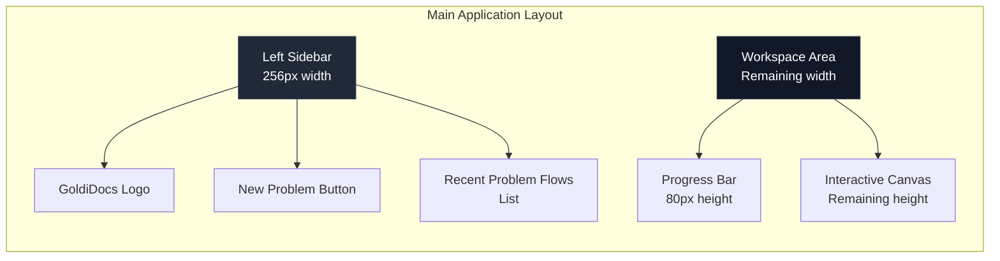

#### Left Sidebar Components
The sidebar contains:
- **Header**: GoldiDocs branding
- **New Problem Button**: Primary action to start new flow
- **Recent Problem Flows**: Scrollable list of past projects

```mermaid
graph TD
    subgraph "Sidebar Problem Flow Cards"
        A[Problem Flow Card] --> B[Problem Statement<br/>2 lines max]
        A --> C[Relative Timestamp<br/>e.g. 2 hours ago]
        A --> D[Progress Indicator<br/>5 segments]
        
        D --> E[Segment 1: Problem ✓]
        D --> F[Segment 2: Personas ✓]
        D --> G[Segment 3: Pain Points ✓]
        D --> H[Segment 4: Solutions ░]
        D --> I[Segment 5: Specs ░]
    end
    
    style A fill:#374151,stroke:#4b5563,color:#fff
    style E fill:#10b981,color:#fff
    style F fill:#10b981,color:#fff
    style G fill:#10b981,color:#fff
    style H fill:#6b7280,color:#fff
    style I fill:#6b7280,color:#fff
```

#### Initial Canvas State
When no problem flow is selected, the canvas shows an empty state with the problem input node:

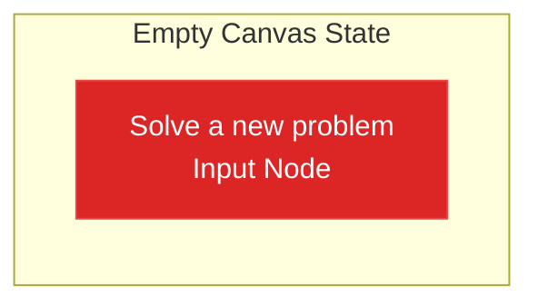

### User Journey 3: Problem Flow Canvas - Step 1 (Problem → Personas)

#### Canvas Initialization
When Sarah enters "I need a CRM that actually helps my sales team close deals" and clicks "Analyze Problem", the interface transforms:

```mermaid
graph LR
    subgraph "Canvas State Progression"
        subgraph "Initial State"
            A[Core Problem<br/>Processing...<br/>Animated Border]
        end
        
        subgraph "After Validation"
            B[Core Problem<br/>Validated ✓<br/>Gold Border]
            B -->|Animated Edge| C[Persona 1]
            B -->|Animated Edge| D[Persona 2]
            B -->|Gold Edge| E[Persona 3<br/>Highest Pain]
            B -->|Animated Edge| F[Persona 4]
            B -->|Animated Edge| G[Persona 5]
        end
    end
    
    style A fill:#dc2626,stroke:#fff,stroke-width:3px,color:#fff
    style B fill:#dc2626,stroke:#ffd700,stroke-width:3px,color:#fff
    style E fill:#14b8a6,stroke:#ffd700,stroke-width:3px,color:#fff
```

#### Problem Validation Animation
The CoreProblemNode displays visual feedback during processing:
- **Processing state**: Animated border gradient pulsing white to transparent
- **Success state**: Border flashes gold 3 times, then stays gold
- **Error state**: Red border with validation feedback message

#### Persona Generation Flow
Once validation succeeds:

1. **Five PersonaNode components appear** with staggered animation:
   - Each appears 150ms after the previous
   - Fade in + scale from 0.8 to 1.0
   - Positioned vertically with 140px spacing

2. **Edges animate from problem to personas**:
   - Start from problem node's right handle
   - Animate path drawing over 300ms
   - All edges gray except highest pain_degree (gold)

3. **Progress Bar updates**:
   ```mermaid
   graph LR
       A[Problem → Personas<br/>Complete] 
       B[Personas → Pain Points<br/>Processing]
       C[Pain Points → Solutions<br/>Pending]
       D[Solutions → Specs<br/>Pending]
       
       style A fill:#ffd700,stroke:#ffd700,color:#000
       style B fill:#3b82f6,stroke:#3b82f6,color:#fff
       style C fill:#6b7280,stroke:#6b7280,color:#fff
       style D fill:#6b7280,stroke:#6b7280,color:#fff
   ```

### User Journey 4: Problem Flow Canvas - Step 2 (Personas → Pain Points)

#### Canvas Reorganization
When pain points are generated, the canvas smoothly transitions:

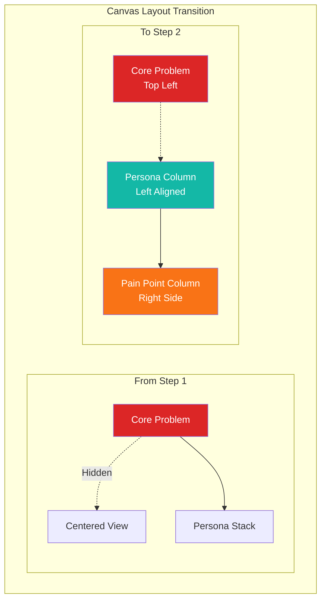

#### Pain Point Generation with Attribution
The system generates 7 pain points, each connected to relevant personas:

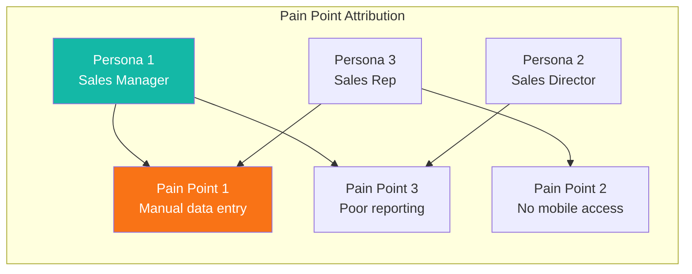

#### Lock and Refresh Functionality
Each node includes interactive controls:

```mermaid
graph TD
    subgraph "Node Controls"
        A[Node Header] --> B[Lock Icon 🔒]
        C[Column Header] --> D[Refresh Icon ↻]
        
        B --> E[Locked State<br/>Prevents Regeneration]
        D --> F[Refresh Action<br/>Regenerates Unlocked Items]
    end
```

Refresh behavior:
- Locked items remain unchanged
- Unlocked items are regenerated
- New items consider locked items to avoid duplication
- All changes are recorded in event log

#### Interactive Selection
Selection behavior:
- Click persona → highlights with blue ring + connected pain points glow
- Click pain point → highlights with orange glow effect
- Multi-select enabled with Shift+click
- Selection state determines what data flows to next step

### User Journey 5: Problem Flow Canvas - Step 3 (Pain Points → Solutions → Specifications)

#### Canvas Transition to Solutions View
The canvas performs a smooth slide transition:

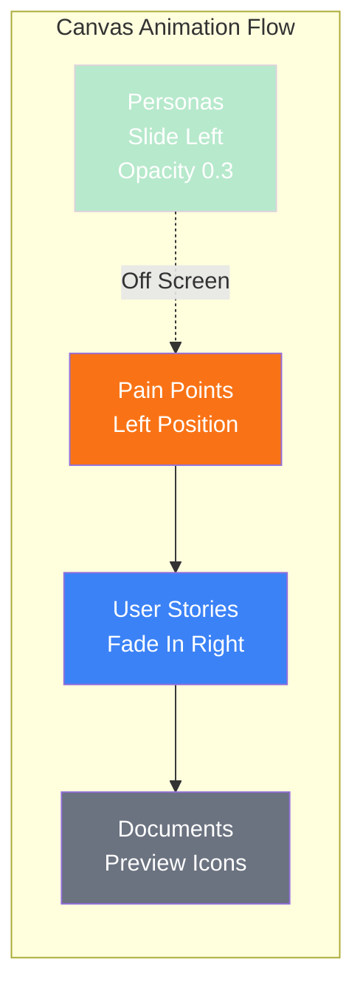

#### User Story Generation and Attribution
User stories connect solutions to pain points:

```mermaid
graph TD
    subgraph "User Story Structure"
        A[Story Header] --> B[Lock Icon 🔒]
        A --> C[Story Number]
        
        D[As a: Sales Manager]
        E[I want: unified dashboard]
        F[So that: I see all activity]
        
        G[Acceptance Criteria]
        G --> H[• Real-time updates]
        G --> I[• Mobile responsive]
        G --> J[• Export capabilities]
    end
    
    style A fill:#3b82f6,color:#fff
```

#### Progressive Document Generation
Document generation follows a dependency chain:

```mermaid
graph TD
    A[Product Vision<br/>⏳ Processing] -->|On Complete| B[Functional Requirements<br/>⏳ Waiting]
    B -->|On Complete| C[System Architecture<br/>⏳ Waiting]
    C -->|On Complete| D[Data Flow<br/>⏳ Waiting]
    C -->|On Complete| E[Design System<br/>⏳ Waiting]
    D -->|On Complete| F[Database Schema<br/>⏳ Waiting]
    
    style A fill:#3b82f6,color:#fff
    style B fill:#6b7280,color:#fff
    style C fill:#6b7280,color:#fff
    style D fill:#6b7280,color:#fff
    style E fill:#6b7280,color:#fff
    style F fill:#6b7280,color:#fff
```

Visual States:
- ⏳ Pending (gray, clock icon)
- 🔄 Processing (blue, spinning loader)
- ✅ Complete (green, checkmark)
- ❌ Error (red, x icon)

#### Document Node Component
Each document displays its generation status:

```mermaid
graph LR
    subgraph "Document States"
        subgraph "Processing"
            A1[Product Vision 🔄]
            A2[Loading Animation]
            A3[Progress Bar]
        end
        
        subgraph "Complete"
            B1[Product Vision ✅]
            B2[Executive Summary]
            B3[Content Preview]
        end
    end
    
    style A1 fill:#3b82f6,color:#fff
    style B1 fill:#10b981,color:#fff
```

## Version Control & State Management

### Event Sourcing Architecture
Every action creates an immutable event record:

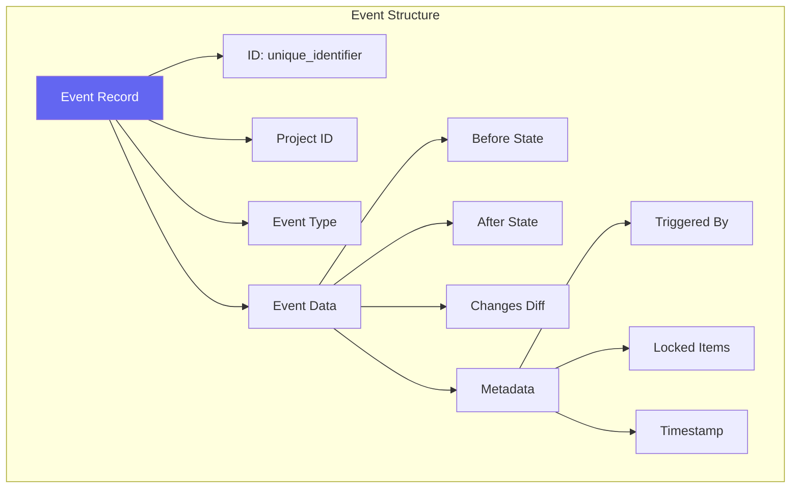

### Time Travel Interface
A timeline appears at the bottom of the canvas:

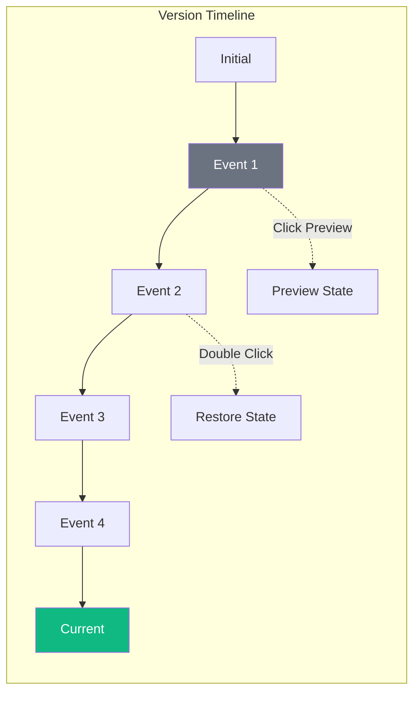

## Key Design Decisions

### 1. Single Canvas Architecture
Unlike traditional multi-step wizards, GoldiDocs uses one continuous canvas that reveals content progressively. This maintains context and allows users to see their journey visually.

### 2. Selective Locking & Regeneration
Users maintain control over AI generation through:
- Individual item locking (personas, pain points, solutions)
- Column-level refresh that respects locked items
- Version control for every state change

### 3. Attribution-Based Connections
Every element maintains relationships:
- Pain points know which personas experience them
- Solutions know which pain points they address
- User stories connect to specific solutions
- This creates a traceable lineage from problem to implementation

### 4. Progressive Enhancement
The interface reveals complexity gradually:
- Start with a simple problem input
- Expand to show relationships
- End with comprehensive documentation
- Each step builds on the previous

### 5. Real-Time Visual Feedback
Every async operation has visual feedback:
- Processing: Animated borders/gradients
- Success: Gold flash and persistent highlight
- Connections: Animated edges during data flow
- Progress: Clear step indicators

## Technical Implementation Priorities

### Phase 1: Core Canvas Flow (MVP)
1. Problem input and validation
2. Persona generation with basic canvas
3. Pain point generation with connections
4. Basic export functionality

### Phase 2: Advanced Features
1. Solution generation and mapping
2. User story creation
3. Document generation pipeline
4. Version control with time travel

### Phase 3: Polish & Scale
1. Advanced animations and transitions
2. Collaborative features
3. Template library
4. API for external integrations

## Success Metrics

### User Experience
- Time from problem to specification: < 30 minutes
- Number of regenerations needed: < 3 per step
- User satisfaction with generated content: > 85%

### Technical Performance
- Canvas interaction: 60 FPS
- AI generation response: < 5 seconds
- Document generation: < 30 seconds total
- Memory usage: < 500MB

### Business Impact
- Reduced specification writing time: 90%
- Improved requirement quality: Measurable through implementation success
- Team alignment: Faster consensus through visual representation

## Conclusion

GoldiDocs revolutionizes the journey from idea to implementation by providing a visual, AI-powered workflow that maintains user control while automating the tedious parts of specification writing. Through its innovative use of React Flow for visualization, LangGraph for intelligent processing, and comprehensive version control, it enables teams to create better software specifications faster than ever before.