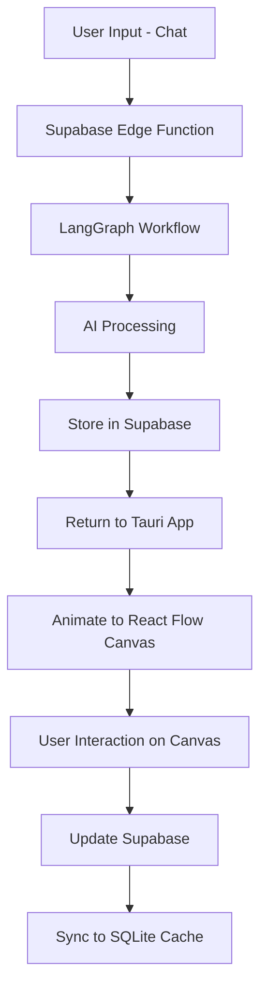

# Prob - Simplified Architecture
## Interactive Canvas for Product Development

### 1. Technology Stack
- **Framework**: Tauri for macOS app
- **Frontend**: Vite + React + TypeScript
- **Canvas Interface**: React Flow for interactive node-based UI
- **Styling**: TailwindCSS
- **Backend Services**: 
  - Supabase (PostgreSQL) for data persistence
  - Supabase Edge Functions for LangGraph AI workflows
  - SQLite for local state caching
- **State Management**: Zustand or Redux Toolkit

### 2. Core User Experience Flow

#### Starting Point: Chat Interface
```typescript
interface ChatToCanvasFlow {
  // 1. User types their problem
  chatInput: string;
  
  // 2. AI generates initial analysis
  aiResponse: {
    coreProblem: string;
    personas: Persona[];
    painPoints: PainPoint[];
    solutions: Solution[];
  };
  
  // 3. Animate to React Flow canvas
  canvasTransition: {
    fromChat: boolean;
    animateNodes: boolean;
    initialLayout: 'hierarchical' | 'force' | 'grid';
  };
}
```

#### React Flow Canvas Components
```typescript
// Main app component
export function App() {
  const [mode, setMode] = useState<'chat' | 'canvas'>('chat');
  const [problemData, setProblemData] = useState(null);
  
  return (
    <div className="h-screen w-screen bg-gray-900">
      {mode === 'chat' ? (
        <ChatInterface 
          onSubmit={async (problem) => {
            const data = await analyzeProblem(problem);
            setProblemData(data);
            setMode('canvas');
          }}
        />
      ) : (
        <CanvasInterface 
          initialData={problemData}
          onBack={() => setMode('chat')}
        />
      )}
    </div>
  );
}

// Chat interface component
function ChatInterface({ onSubmit }) {
  return (
    <div className="flex items-center justify-center h-full">
      <div className="max-w-2xl w-full p-8">
        <h1 className="text-4xl font-bold text-white mb-8">
          What problem are you trying to solve?
        </h1>
        <textarea
          className="w-full h-32 p-4 rounded-lg bg-gray-800 text-white"
          placeholder="Describe your problem..."
          onKeyDown={(e) => {
            if (e.key === 'Enter' && e.metaKey) {
              onSubmit(e.target.value);
            }
          }}
        />
        <button className="mt-4 px-6 py-3 bg-blue-600 text-white rounded-lg">
          Analyze Problem
        </button>
      </div>
    </div>
  );
}

// Canvas interface with React Flow
function CanvasInterface({ initialData }) {
  const [nodes, setNodes, onNodesChange] = useNodesState([]);
  const [edges, setEdges, onEdgesChange] = useEdgesState([]);
  
  useEffect(() => {
    // Animate nodes appearing on canvas
    const { nodes: flowNodes, edges: flowEdges } = 
      transformDataToFlow(initialData);
    
    // Stagger node appearance
    flowNodes.forEach((node, index) => {
      setTimeout(() => {
        setNodes(prev => [...prev, node]);
      }, index * 100);
    });
    
    // Add edges after nodes
    setTimeout(() => {
      setEdges(flowEdges);
    }, flowNodes.length * 100);
  }, [initialData]);
  
  return (
    <ReactFlow
      nodes={nodes}
      edges={edges}
      onNodesChange={onNodesChange}
      onEdgesChange={onEdgesChange}
      fitView
    >
      <Background />
      <Controls />
      <MiniMap />
    </ReactFlow>
  );
}
```

### 3. Supabase Edge Functions for LangGraph

#### Problem Analysis Function
```typescript
// supabase/functions/analyze-problem/index.ts
import { serve } from "https://deno.land/std/http/server.ts"
import { StateGraph } from "langgraph"

const workflow = new StateGraph({
  channels: {
    problem: null,
    personas: null,
    painPoints: null,
    solutions: null,
  }
});

// Add LangGraph nodes
workflow.addNode("extractCoreProblem", extractCoreProblem);
workflow.addNode("generatePersonas", generatePersonas);
workflow.addNode("identifyPainPoints", identifyPainPoints);
workflow.addNode("proposeSolutions", proposeSolutions);

// Define flow
workflow.setEntryPoint("extractCoreProblem");
workflow.addEdge("extractCoreProblem", "generatePersonas");
workflow.addEdge("generatePersonas", "identifyPainPoints");
workflow.addEdge("identifyPainPoints", "proposeSolutions");

serve(async (req) => {
  const { problem } = await req.json();
  
  // Run LangGraph workflow
  const result = await workflow.invoke({ problem });
  
  return new Response(JSON.stringify(result), {
    headers: { "Content-Type": "application/json" },
  });
});
```

### 4. Data Flow Architecture



### 5. Tauri Integration

```rust
// src-tauri/src/main.rs
#[tauri::command]
async fn analyze_problem(problem: String) -> Result<AnalysisResult, String> {
    // Call Supabase Edge Function
    let client = reqwest::Client::new();
    let response = client
        .post(&format!("{}/functions/v1/analyze-problem", SUPABASE_URL))
        .header("Authorization", format!("Bearer {}", SUPABASE_ANON_KEY))
        .json(&json!({ "problem": problem }))
        .send()
        .await?;
    
    let result: AnalysisResult = response.json().await?;
    
    // Cache in SQLite
    cache_analysis_result(&result).await?;
    
    Ok(result)
}

#[tauri::command]
async fn save_canvas_state(nodes: Vec<Node>, edges: Vec<Edge>) -> Result<(), String> {
    // Save to SQLite for offline access
    save_to_sqlite(&nodes, &edges).await?;
    
    // Sync to Supabase
    sync_to_supabase(&nodes, &edges).await?;
    
    Ok(())
}
```

### 6. Animation & Transitions

```typescript
// Smooth transition from chat to canvas
const animateToCanvas = async (data: AnalysisResult) => {
  // Fade out chat
  await animate('.chat-container', { opacity: 0 }, { duration: 0.3 });
  
  // Switch to canvas mode
  setMode('canvas');
  
  // Animate nodes appearing
  const positions = calculateNodePositions(data);
  
  data.personas.forEach((persona, i) => {
    setTimeout(() => {
      addNode({
        id: persona.id,
        type: 'persona',
        position: positions[persona.id],
        data: persona,
        style: { opacity: 0 },
      });
      
      // Fade in node
      animateNode(persona.id, { opacity: 1 });
    }, i * 150);
  });
};
```

### 7. Local SQLite Schema (Simplified)

```sql
-- Simple caching for offline mode
CREATE TABLE canvas_states (
    id TEXT PRIMARY KEY,
    project_id TEXT,
    nodes JSON,
    edges JSON,
    created_at TIMESTAMP DEFAULT CURRENT_TIMESTAMP,
    updated_at TIMESTAMP DEFAULT CURRENT_TIMESTAMP
);

CREATE TABLE analysis_results (
    id TEXT PRIMARY KEY,
    problem_text TEXT,
    result JSON,
    created_at TIMESTAMP DEFAULT CURRENT_TIMESTAMP
);
```

### 8. Key Features

1. **Simple Start**: Begin with a chat interface asking for the problem
2. **AI Analysis**: LangGraph processes the problem via Edge Functions
3. **Visual Transition**: Smooth animation from chat to canvas
4. **Interactive Canvas**: Full React Flow functionality for exploration
5. **Auto-Save**: Canvas state saved to both SQLite and Supabase
6. **Offline Support**: SQLite cache enables offline viewing

### 9. User Journey

1. **Launch App** → See clean chat interface
2. **Type Problem** → Simple textarea input
3. **Submit** → Loading animation while AI processes
4. **Canvas Appears** → Nodes animate in showing analysis
5. **Interact** → Pan, zoom, click nodes for details
6. **Iterate** → Modify and refine on the canvas
7. **Export** → Generate final artifacts

This simplified architecture focuses on the core user experience of transforming a text problem into an interactive visual analysis using React Flow as the primary interface.