# GoldiDocs - Data Flow Diagram with Local Storage

## Overview

This document illustrates the complete data flow architecture for Prob, incorporating local SQLite storage with consistency mechanisms, Supabase cloud synchronization, and the React Flow canvas visualization layer.

## High-Level Architecture

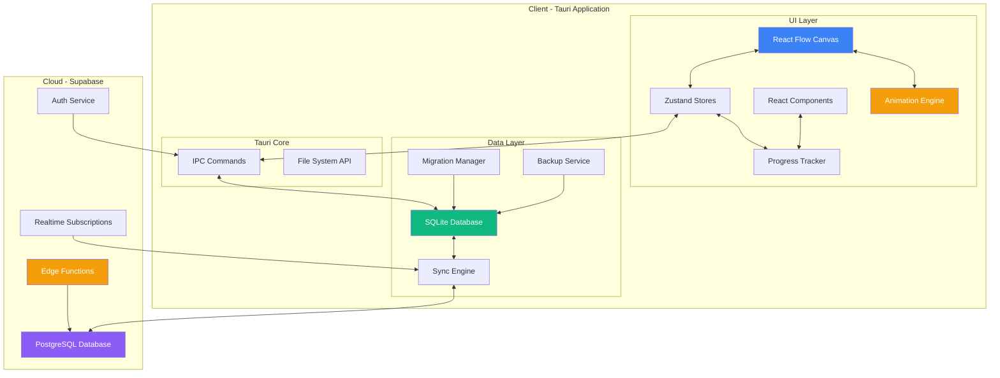
```mermaid
graph TB
    subgraph "Client - Tauri Application"
        subgraph "UI Layer"
            A[React Flow Canvas]
            B[Zustand Stores]
            C[React Components]
            N[Animation Engine]
            O[Progress Tracker]
        end
        
        subgraph "Data Layer"
            D[SQLite Database]
            E[Sync Engine]
            F[Migration Manager]
            G[Backup Service]
        end
        
        subgraph "Tauri Core"
            H[IPC Commands]
            I[File System API]
        end
    end
    
    subgraph "Cloud - Supabase"
        J[PostgreSQL Database]
        K[Edge Functions]
        L[Realtime Subscriptions]
        M[Auth Service]
    end
    
    A <--> B
    A <--> N
    B <--> H
    B <--> O
    C <--> O
    H <--> D
    D <--> E
    E <--> J
    K --> J
    L --> E
    F --> D
    G --> D
    M --> H
    
    style A fill:#3b82f6,color:#fff
    style D fill:#10b981,color:#fff
    style J fill:#8b5cf6,color:#fff
    style K fill:#f59e0b,color:#fff
    style N fill:#f59e0b,color:#fff
```

## Detailed Data Flow Sequences

### 1. Application Startup Flow with Demo Canvas

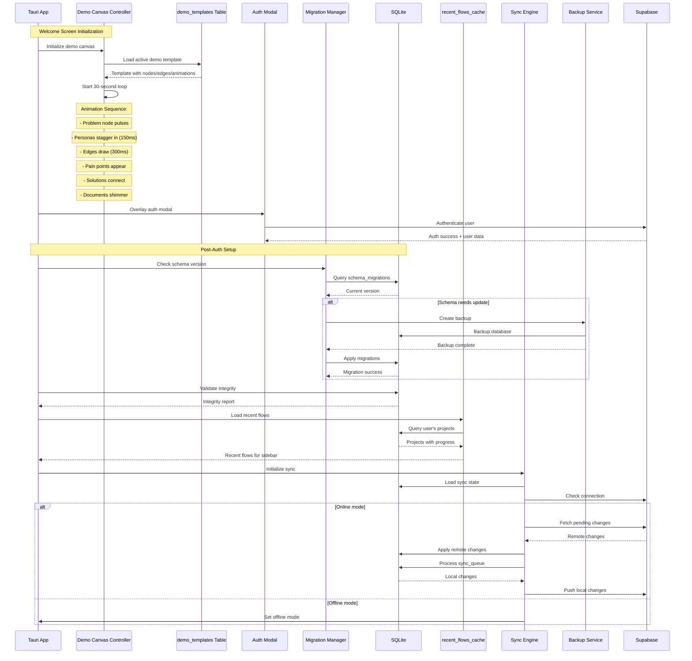
```mermaid
sequenceDiagram
    participant App as Tauri App
    participant Demo as Demo Canvas Controller
    participant DT as demo_templates Table
    participant Auth as Auth Modal
    participant MM as Migration Manager
    participant DB as SQLite
    participant RFC as recent_flows_cache
    participant Sync as Sync Engine
    participant Backup as Backup Service
    participant Supa as Supabase
    
    Note over App,Demo: Welcome Screen Initialization
    
    App->>Demo: Initialize demo canvas
    Demo->>DT: Load active demo template
    DT-->>Demo: Template with nodes/edges/animations
    
    Demo->>Demo: Start 30-second loop
    Note over Demo: Animation Sequence:
    Note over Demo: - Problem node pulses
    Note over Demo: - Personas stagger in (150ms)
    Note over Demo: - Edges draw (300ms)
    Note over Demo: - Pain points appear
    Note over Demo: - Solutions connect
    Note over Demo: - Documents shimmer
    
    App->>Auth: Overlay auth modal
    Auth->>Supa: Authenticate user
    Supa-->>Auth: Auth success + user data
    
    Note over App,DB: Post-Auth Setup
    
    App->>MM: Check schema version
    MM->>DB: Query schema_migrations
    DB-->>MM: Current version
    
    alt Schema needs update
        MM->>Backup: Create backup
        Backup->>DB: Backup database
        Backup-->>MM: Backup complete
        MM->>DB: Apply migrations
        DB-->>MM: Migration success
    end
    
    App->>DB: Validate integrity
    DB-->>App: Integrity report
    
    App->>RFC: Load recent flows
    RFC->>DB: Query user's projects
    DB-->>RFC: Projects with progress
    RFC-->>App: Recent flows for sidebar
    
    App->>Sync: Initialize sync
    Sync->>DB: Load sync state
    Sync->>Supa: Check connection
    
    alt Online mode
        Sync->>Supa: Fetch pending changes
        Supa-->>Sync: Remote changes
        Sync->>DB: Apply remote changes
        Sync->>DB: Process sync_queue
        DB-->>Sync: Local changes
        Sync->>Supa: Push local changes
    else Offline mode
        Sync->>App: Set offline mode
    end
```

### 2. Problem Input & Validation Flow with Progress Tracking

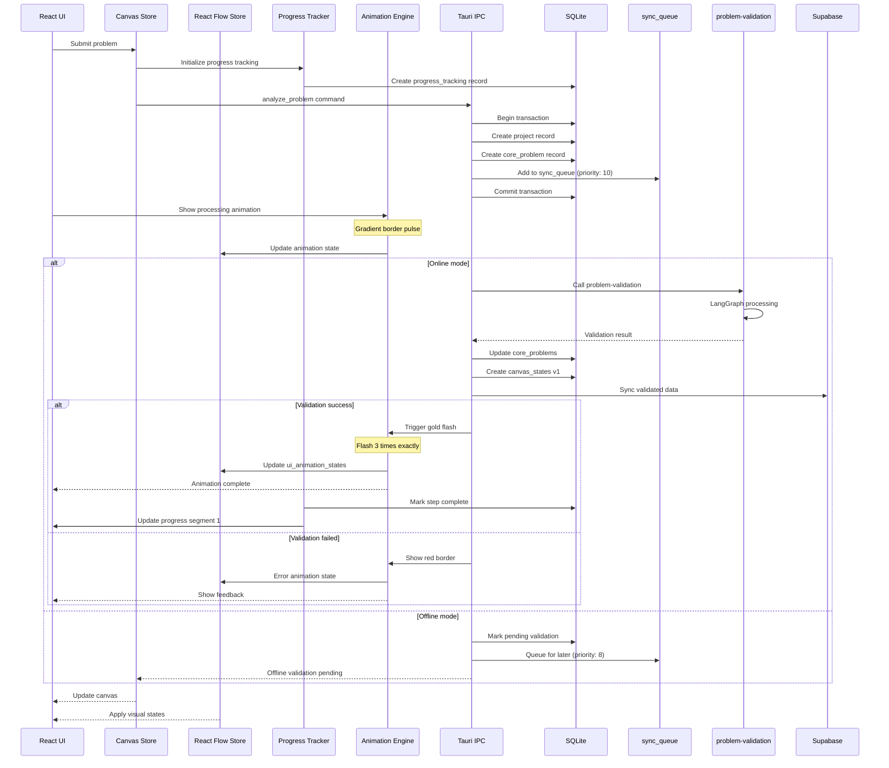
```mermaid
sequenceDiagram
    participant UI as React UI
    participant CS as Canvas Store
    participant RFS as React Flow Store
    participant PT as Progress Tracker
    participant Anim as Animation Engine
    participant IPC as Tauri IPC
    participant DB as SQLite
    participant Queue as sync_queue
    participant Edge as problem-validation
    participant Supa as Supabase
    
    UI->>CS: Submit problem
    CS->>PT: Initialize progress tracking
    PT->>DB: Create progress_tracking record
    
    CS->>IPC: analyze_problem command
    
    IPC->>DB: Begin transaction
    IPC->>DB: Create project record
    IPC->>DB: Create core_problem record
    IPC->>Queue: Add to sync_queue (priority: 10)
    IPC->>DB: Commit transaction
    
    UI->>Anim: Show processing animation
    Note over Anim: Gradient border pulse
    Anim->>RFS: Update animation state
    
    alt Online mode
        IPC->>Edge: Call problem-validation
        Edge->>Edge: LangGraph processing
        Edge-->>IPC: Validation result
        IPC->>DB: Update core_problems
        IPC->>DB: Create canvas_states v1
        IPC->>Supa: Sync validated data
        
        alt Validation success
            IPC->>Anim: Trigger gold flash
            Note over Anim: Flash 3 times exactly
            Anim->>RFS: Update ui_animation_states
            Anim-->>UI: Animation complete
            
            PT->>DB: Mark step complete
            PT->>UI: Update progress segment 1
        else Validation failed
            IPC->>Anim: Show red border
            Anim->>RFS: Error animation state
            Anim-->>UI: Show feedback
        end
    else Offline mode
        IPC->>DB: Mark pending validation
        IPC->>Queue: Queue for later (priority: 8)
        IPC-->>CS: Offline validation pending
    end
    
    CS-->>UI: Update canvas
    RFS-->>UI: Apply visual states
```

### 3. Persona Generation with Progress Bar Update

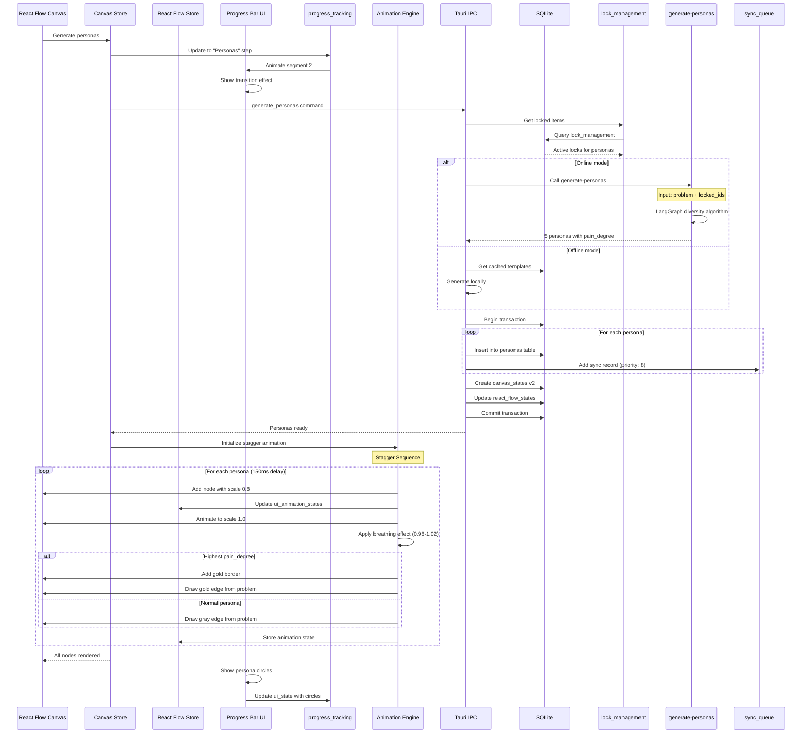
```mermaid
sequenceDiagram
    participant Canvas as React Flow Canvas
    participant CS as Canvas Store
    participant RFS as React Flow Store
    participant Progress as Progress Bar UI
    participant PT as progress_tracking
    participant Anim as Animation Engine
    participant IPC as Tauri IPC
    participant DB as SQLite
    participant Lock as lock_management
    participant Edge as generate-personas
    participant Queue as sync_queue
    
    Canvas->>CS: Generate personas
    CS->>PT: Update to "Personas" step
    PT->>Progress: Animate segment 2
    Progress->>Progress: Show transition effect
    
    CS->>IPC: generate_personas command
    
    IPC->>Lock: Get locked items
    Lock->>DB: Query lock_management
    DB-->>Lock: Active locks for personas
    
    alt Online mode
        IPC->>Edge: Call generate-personas
        Note over Edge: Input: problem + locked_ids
        Edge->>Edge: LangGraph diversity algorithm
        Edge-->>IPC: 5 personas with pain_degree
    else Offline mode
        IPC->>DB: Get cached templates
        IPC->>IPC: Generate locally
    end
    
    IPC->>DB: Begin transaction
    
    loop For each persona
        IPC->>DB: Insert into personas table
        IPC->>Queue: Add sync record (priority: 8)
    end
    
    IPC->>DB: Create canvas_states v2
    IPC->>DB: Update react_flow_states
    IPC->>DB: Commit transaction
    
    IPC-->>CS: Personas ready
    CS->>Anim: Initialize stagger animation
    
    Note over Anim: Stagger Sequence
    loop For each persona (150ms delay)
        Anim->>Canvas: Add node with scale 0.8
        Anim->>RFS: Update ui_animation_states
        Anim->>Canvas: Animate to scale 1.0
        Anim->>Anim: Apply breathing effect (0.98-1.02)
        
        alt Highest pain_degree
            Anim->>Canvas: Add gold border
            Anim->>Canvas: Draw gold edge from problem
        else Normal persona
            Anim->>Canvas: Draw gray edge from problem
        end
        
        Anim->>RFS: Store animation state
    end
    
    CS-->>Canvas: All nodes rendered
    Progress->>Progress: Show persona circles
    Progress->>PT: Update ui_state with circles
```

### 4. Synchronization Flow

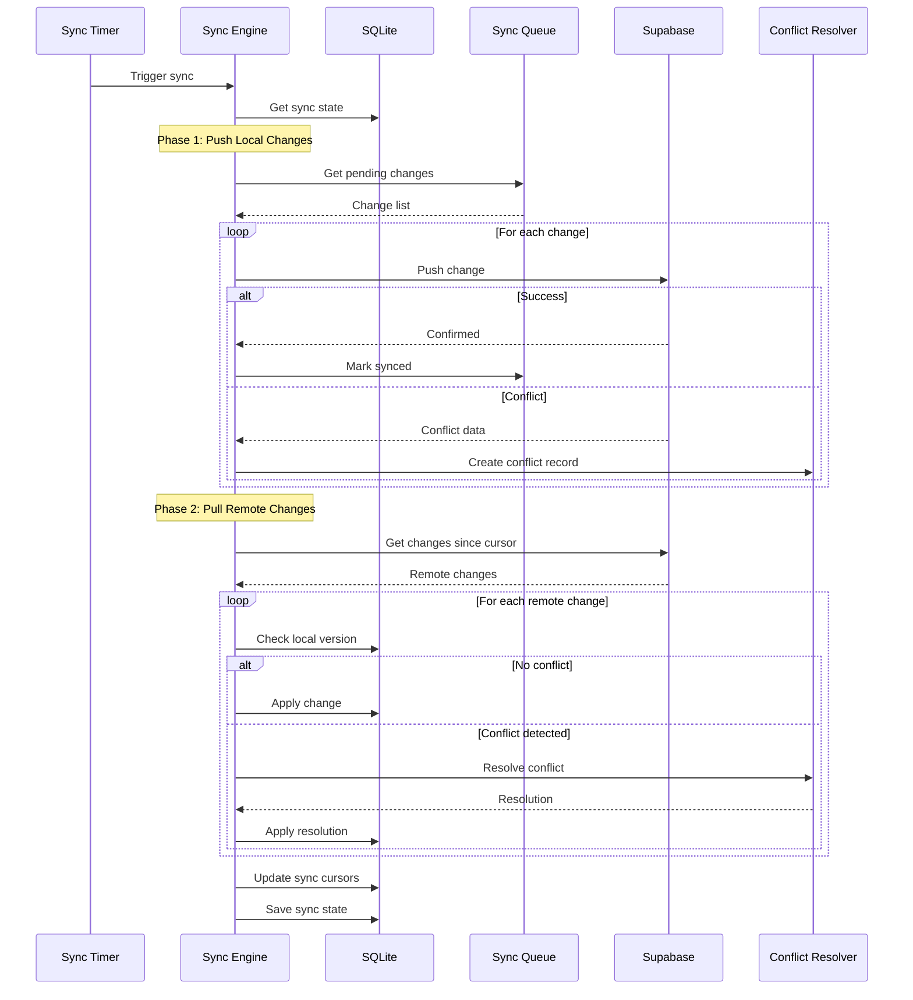
```mermaid
sequenceDiagram
    participant Timer as Sync Timer
    participant Engine as Sync Engine
    participant DB as SQLite
    participant Queue as Sync Queue
    participant Supa as Supabase
    participant Conflict as Conflict Resolver
    
    Timer->>Engine: Trigger sync
    Engine->>DB: Get sync state
    
    Note over Engine: Phase 1: Push Local Changes
    Engine->>Queue: Get pending changes
    Queue-->>Engine: Change list
    
    loop For each change
        Engine->>Supa: Push change
        alt Success
            Supa-->>Engine: Confirmed
            Engine->>Queue: Mark synced
        else Conflict
            Supa-->>Engine: Conflict data
            Engine->>Conflict: Create conflict record
        end
    end
    
    Note over Engine: Phase 2: Pull Remote Changes
    Engine->>Supa: Get changes since cursor
    Supa-->>Engine: Remote changes
    
    loop For each remote change
        Engine->>DB: Check local version
        alt No conflict
            Engine->>DB: Apply change
        else Conflict detected
            Engine->>Conflict: Resolve conflict
            Conflict-->>Engine: Resolution
            Engine->>DB: Apply resolution
        end
    end
    
    Engine->>DB: Update sync cursors
    Engine->>DB: Save sync state
```

### 5. Conflict Resolution Flow

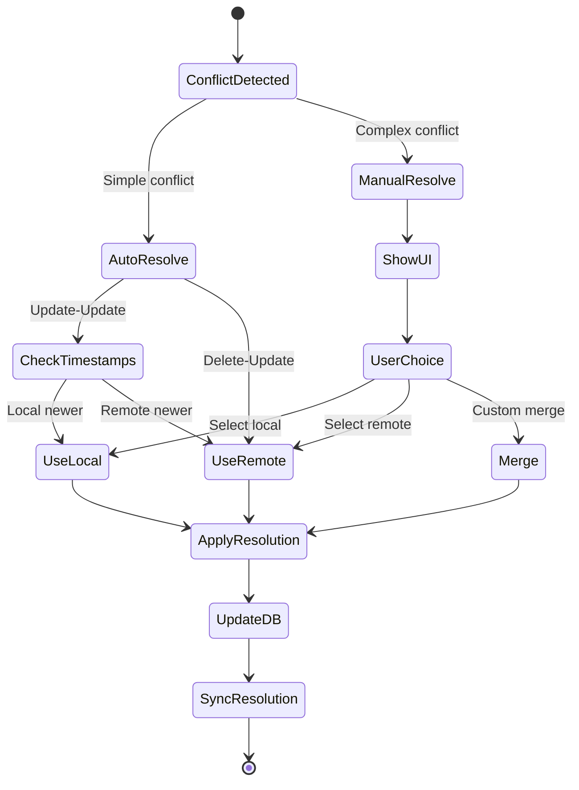
```mermaid
stateDiagram-v2
    [*] --> ConflictDetected
    ConflictDetected --> AutoResolve: Simple conflict
    ConflictDetected --> ManualResolve: Complex conflict
    
    AutoResolve --> CheckTimestamps: Update-Update
    AutoResolve --> UseRemote: Delete-Update
    
    CheckTimestamps --> UseLocal: Local newer
    CheckTimestamps --> UseRemote: Remote newer
    
    ManualResolve --> ShowUI
    ShowUI --> UserChoice
    UserChoice --> UseLocal: Select local
    UserChoice --> UseRemote: Select remote
    UserChoice --> Merge: Custom merge
    
    UseLocal --> ApplyResolution
    UseRemote --> ApplyResolution
    Merge --> ApplyResolution
    
    ApplyResolution --> UpdateDB
    UpdateDB --> SyncResolution
    SyncResolution --> [*]
```

### 6. Canvas State Management Flow (Separated Architecture)

```mermaid
graph LR
    subgraph "User Interactions"
        A[Pan/Zoom Canvas]
        B[Select Nodes]
        C[Add Persona]
        D[Lock Item]
    end
    
    subgraph "React Flow State (UI)"
        E[react_flow_states Table]
        F[viewport: {x, y, zoom}]
        G[selection_ids: array]
        H[animation_queue: JSON]
        I[No Version Control]
    end
    
    subgraph "Canvas State (Business)"
        J[canvas_states Table]
        K[nodes: personas/problems/etc]
        L[edges: relationships]
        M[Version Controlled]
        N[Event Sourced]
    end
    
    subgraph "Version History"
        O[langgraph_state_events]
        P[before_state]
        Q[after_state]
        R[state_diff]
    end
    
    A --> E
    B --> G
    E --> F
    E --> G
    E --> H
    
    C --> J
    D --> J
    J --> K
    J --> L
    J --> M
    
    M --> O
    O --> P
    O --> Q
    O --> R
    
    style E fill:#3b82f6,color:#fff
    style J fill:#10b981,color:#fff
    style O fill:#8b5cf6,color:#fff
```

### 7. Document Generation Pipeline

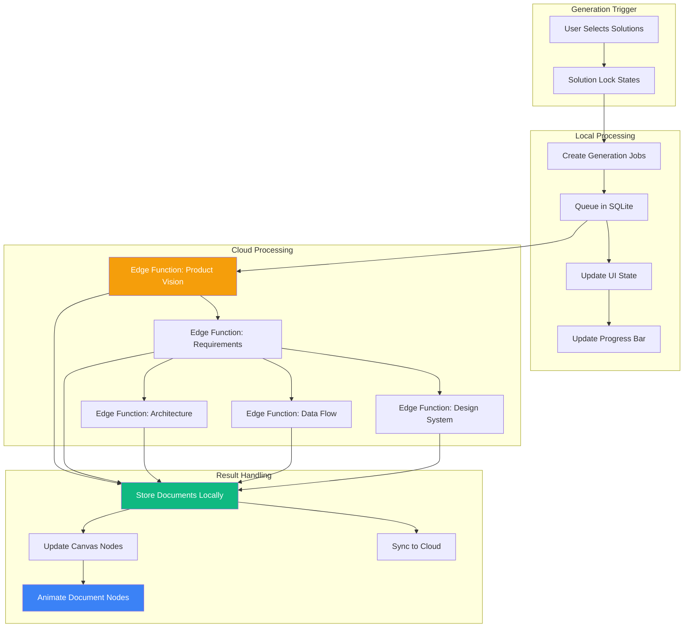
```mermaid
graph TD
    subgraph "Generation Trigger"
        A[User Selects Solutions]
        AA[Solution Lock States]
    end
    
    subgraph "Local Processing"
        B[Create Generation Jobs]
        C[Queue in SQLite]
        D[Update UI State]
        BB[Update Progress Bar]
    end
    
    subgraph "Cloud Processing"
        E[Edge Function: Product Vision]
        F[Edge Function: Requirements]
        G[Edge Function: Architecture]
        H[Edge Function: Data Flow]
        I[Edge Function: Design System]
    end
    
    subgraph "Result Handling"
        J[Store Documents Locally]
        K[Update Canvas Nodes]
        L[Sync to Cloud]
        KK[Animate Document Nodes]
    end
    
    A --> AA
    AA --> B
    B --> C
    C --> D
    D --> BB
    
    C --> E
    E --> F
    F --> G
    F --> H
    F --> I
    
    E --> J
    F --> J
    G --> J
    H --> J
    I --> J
    
    J --> K
    K --> KK
    J --> L
    
    style E fill:#f59e0b,color:#fff
    style J fill:#10b981,color:#fff
    style KK fill:#3b82f6,color:#fff
```

### 8. Backup and Recovery Flow

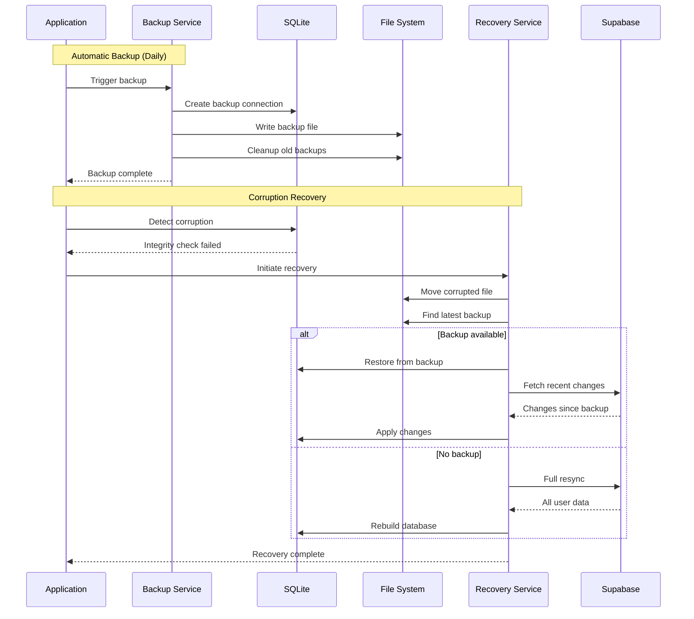
```mermaid
sequenceDiagram
    participant App as Application
    participant Backup as Backup Service
    participant DB as SQLite
    participant FS as File System
    participant Recovery as Recovery Service
    participant Supa as Supabase
    
    Note over App,Backup: Automatic Backup (Daily)
    App->>Backup: Trigger backup
    Backup->>DB: Create backup connection
    Backup->>FS: Write backup file
    Backup->>FS: Cleanup old backups
    Backup-->>App: Backup complete
    
    Note over App,Recovery: Corruption Recovery
    App->>DB: Detect corruption
    DB-->>App: Integrity check failed
    App->>Recovery: Initiate recovery
    Recovery->>FS: Move corrupted file
    Recovery->>FS: Find latest backup
    
    alt Backup available
        Recovery->>DB: Restore from backup
        Recovery->>Supa: Fetch recent changes
        Supa-->>Recovery: Changes since backup
        Recovery->>DB: Apply changes
    else No backup
        Recovery->>Supa: Full resync
        Supa-->>Recovery: All user data
        Recovery->>DB: Rebuild database
    end
    
    Recovery-->>App: Recovery complete
```

## Data Consistency Guarantees

### 1. Transaction Boundaries

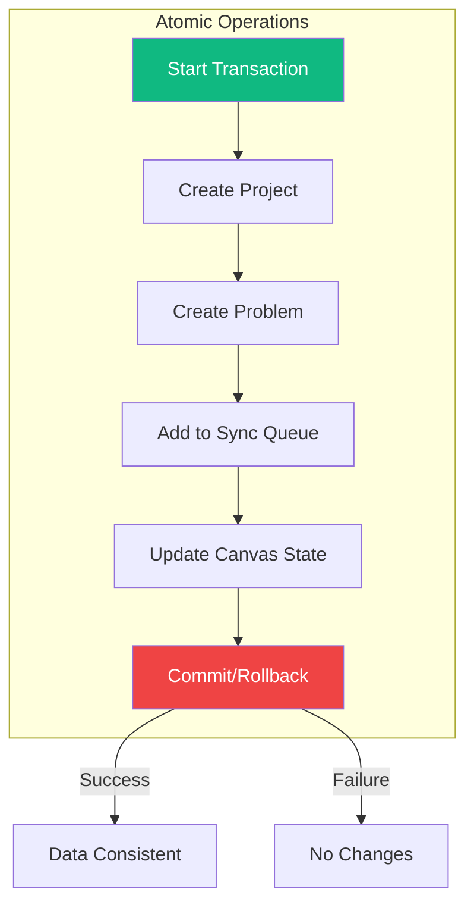
```mermaid
graph TD
    subgraph "Atomic Operations"
        A[Start Transaction]
        B[Create Project]
        C[Create Problem]
        D[Add to Sync Queue]
        E[Update Canvas State]
        F[Commit/Rollback]
    end
    
    A --> B
    B --> C
    C --> D
    D --> E
    E --> F
    
    F -->|Success| G[Data Consistent]
    F -->|Failure| H[No Changes]
    
    style A fill:#10b981,color:#fff
    style F fill:#ef4444,color:#fff
```

### 2. Version Control Flow

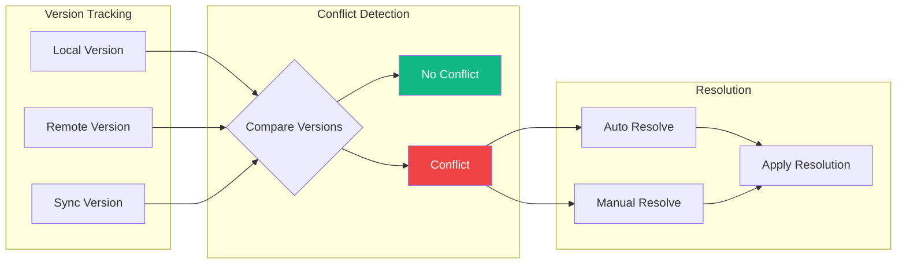
```mermaid
graph LR
    subgraph "Version Tracking"
        A[Local Version]
        B[Remote Version]
        C[Sync Version]
    end
    
    subgraph "Conflict Detection"
        D{Compare Versions}
        E[No Conflict]
        F[Conflict]
    end
    
    subgraph "Resolution"
        G[Auto Resolve]
        H[Manual Resolve]
        I[Apply Resolution]
    end
    
    A --> D
    B --> D
    C --> D
    
    D --> E
    D --> F
    
    F --> G
    F --> H
    G --> I
    H --> I
    
    style F fill:#ef4444,color:#fff
    style E fill:#10b981,color:#fff
```

## Error Handling Flows

### 1. Network Failure Handling

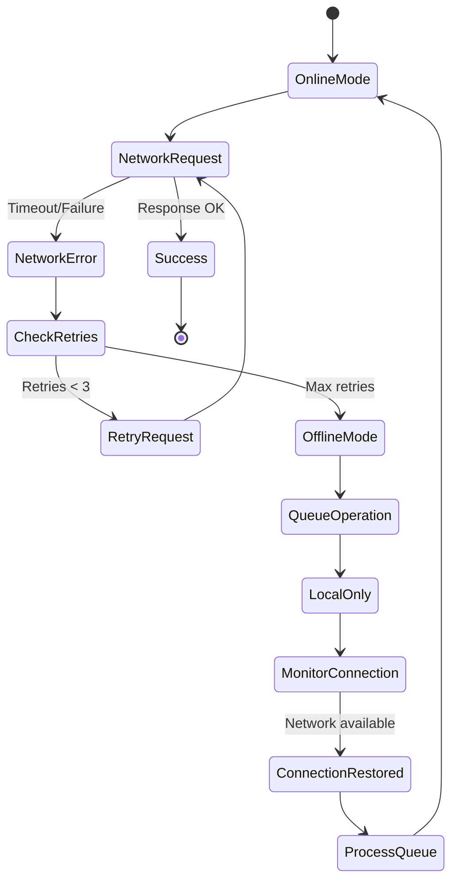
```mermaid
stateDiagram-v2
    [*] --> OnlineMode
    OnlineMode --> NetworkRequest
    NetworkRequest --> Success: Response OK
    NetworkRequest --> NetworkError: Timeout/Failure
    
    NetworkError --> CheckRetries
    CheckRetries --> RetryRequest: Retries < 3
    CheckRetries --> OfflineMode: Max retries
    
    RetryRequest --> NetworkRequest
    
    OfflineMode --> QueueOperation
    QueueOperation --> LocalOnly
    LocalOnly --> MonitorConnection
    
    MonitorConnection --> ConnectionRestored: Network available
    ConnectionRestored --> ProcessQueue
    ProcessQueue --> OnlineMode
    
    Success --> [*]
```

### 2. Migration Failure Recovery

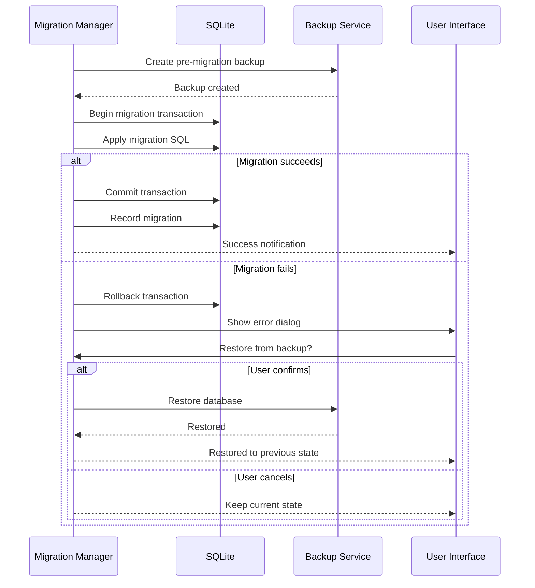
```mermaid
sequenceDiagram
    participant MM as Migration Manager
    participant DB as SQLite
    participant Backup as Backup Service
    participant User as User Interface
    
    MM->>Backup: Create pre-migration backup
    Backup-->>MM: Backup created
    
    MM->>DB: Begin migration transaction
    MM->>DB: Apply migration SQL
    
    alt Migration succeeds
        MM->>DB: Commit transaction
        MM->>DB: Record migration
        MM-->>User: Success notification
    else Migration fails
        MM->>DB: Rollback transaction
        MM->>User: Show error dialog
        User->>MM: Restore from backup?
        
        alt User confirms
            MM->>Backup: Restore database
            Backup-->>MM: Restored
            MM-->>User: Restored to previous state
        else User cancels
            MM-->>User: Keep current state
        end
    end
```

## Canvas Animation & Interaction Flows

### 1. Animation State Management

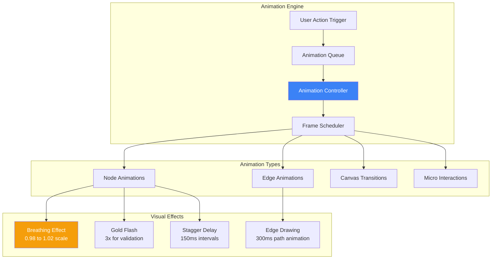
```mermaid
graph TD
    subgraph "Animation Engine"
        A[User Action Trigger]
        B[Animation Queue]
        C[Animation Controller]
        D[Frame Scheduler]
    end
    
    subgraph "Animation Types"
        E[Node Animations]
        F[Edge Animations]
        G[Canvas Transitions]
        H[Micro Interactions]
    end
    
    subgraph "Visual Effects"
        I[Breathing Effect<br/>0.98 to 1.02 scale]
        J[Gold Flash<br/>3x for validation]
        K[Stagger Delay<br/>150ms intervals]
        L[Edge Drawing<br/>300ms path animation]
    end
    
    A --> B
    B --> C
    C --> D
    D --> E
    D --> F
    D --> G
    D --> H
    
    E --> I
    E --> J
    E --> K
    F --> L
    
    style C fill:#3b82f6,color:#fff
    style I fill:#f59e0b,color:#fff
```

### 2. Progress Bar State Flow

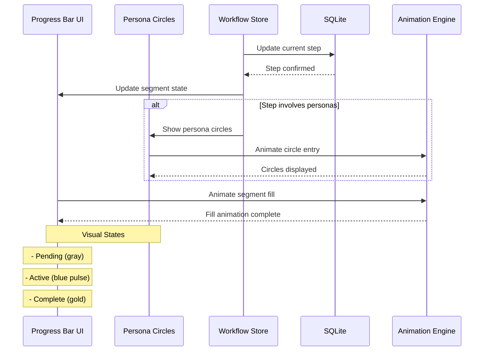
```mermaid
sequenceDiagram
    participant UI as Progress Bar UI
    participant PC as Persona Circles
    participant Store as Workflow Store
    participant DB as SQLite
    participant Anim as Animation Engine
    
    Store->>DB: Update current step
    DB-->>Store: Step confirmed
    Store->>UI: Update segment state
    
    alt Step involves personas
        Store->>PC: Show persona circles
        PC->>Anim: Animate circle entry
        Anim-->>PC: Circles displayed
    end
    
    UI->>Anim: Animate segment fill
    Anim-->>UI: Fill animation complete
    
    Note over UI,PC: Visual States
    Note over UI: - Pending (gray)
    Note over UI: - Active (blue pulse)
    Note over UI: - Complete (gold)
```

### 3. Canvas Layout Transition Flow

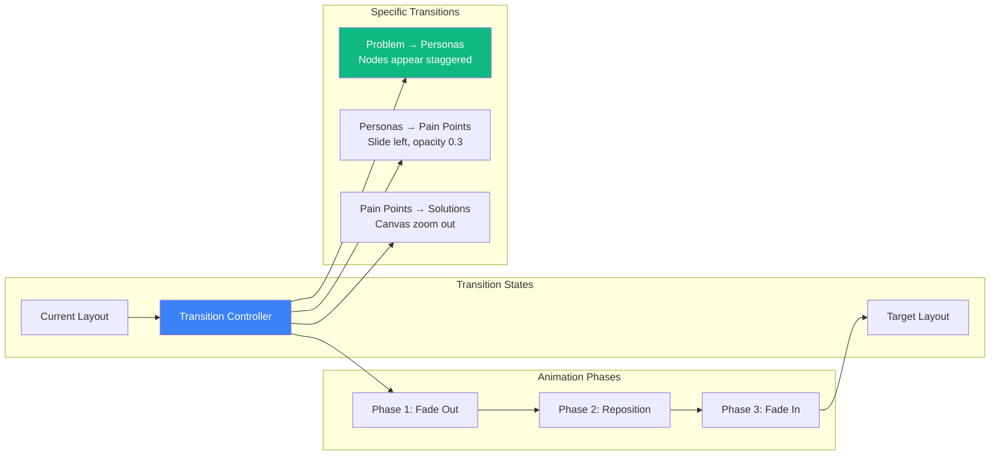
```mermaid
graph LR
    subgraph "Transition States"
        A[Current Layout]
        B[Transition Controller]
        C[Target Layout]
    end
    
    subgraph "Animation Phases"
        D[Phase 1: Fade Out]
        E[Phase 2: Reposition]
        F[Phase 3: Fade In]
    end
    
    subgraph "Specific Transitions"
        G[Problem → Personas<br/>Nodes appear staggered]
        H[Personas → Pain Points<br/>Slide left, opacity 0.3]
        I[Pain Points → Solutions<br/>Canvas zoom out]
    end
    
    A --> B
    B --> D
    D --> E
    E --> F
    F --> C
    
    B --> G
    B --> H
    B --> I
    
    style B fill:#3b82f6,color:#fff
    style G fill:#10b981,color:#fff
```

### 4. Interactive Selection State Management

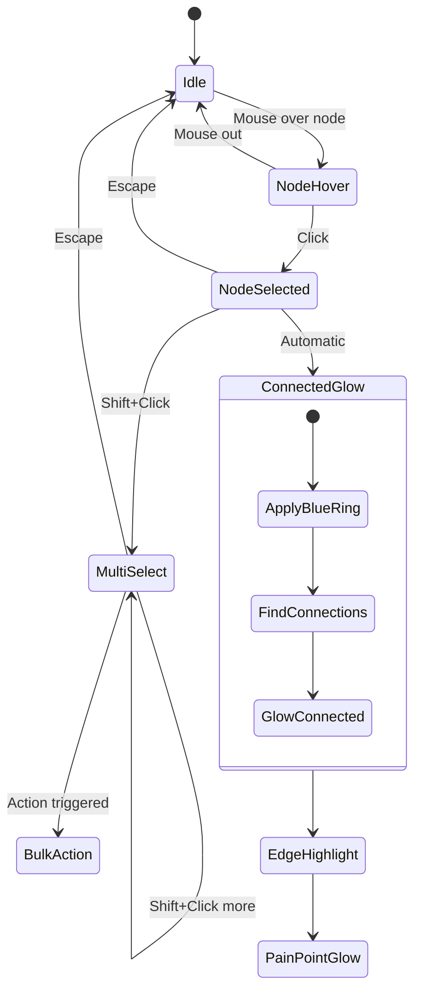
```mermaid
stateDiagram-v2
    [*] --> Idle
    
    Idle --> NodeHover: Mouse over node
    NodeHover --> NodeSelected: Click
    NodeHover --> Idle: Mouse out
    
    NodeSelected --> MultiSelect: Shift+Click
    NodeSelected --> ConnectedGlow: Automatic
    NodeSelected --> Idle: Escape
    
    MultiSelect --> MultiSelect: Shift+Click more
    MultiSelect --> BulkAction: Action triggered
    MultiSelect --> Idle: Escape
    
    ConnectedGlow --> EdgeHighlight
    EdgeHighlight --> PainPointGlow
    
    state ConnectedGlow {
        [*] --> ApplyBlueRing
        ApplyBlueRing --> FindConnections
        FindConnections --> GlowConnected
    }
```

### 5. Recent Problem Flows Query

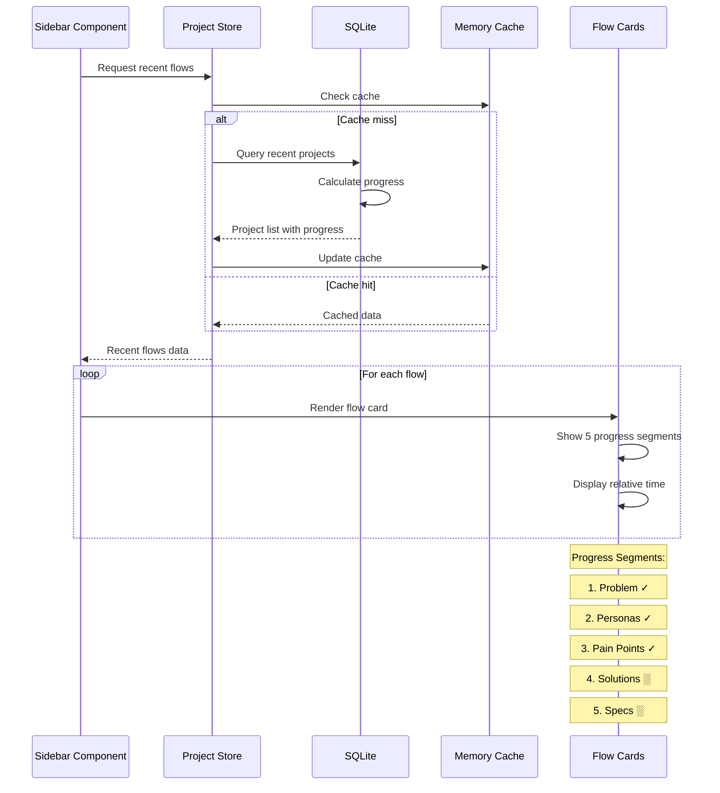
```mermaid
sequenceDiagram
    participant Sidebar as Sidebar Component
    participant Store as Project Store
    participant DB as SQLite
    participant Cache as Memory Cache
    participant UI as Flow Cards
    
    Sidebar->>Store: Request recent flows
    Store->>Cache: Check cache
    
    alt Cache miss
        Store->>DB: Query recent projects
        DB->>DB: Calculate progress
        DB-->>Store: Project list with progress
        Store->>Cache: Update cache
    else Cache hit
        Cache-->>Store: Cached data
    end
    
    Store-->>Sidebar: Recent flows data
    
    loop For each flow
        Sidebar->>UI: Render flow card
        UI->>UI: Show 5 progress segments
        UI->>UI: Display relative time
    end
    
    Note over UI: Progress Segments:
    Note over UI: 1. Problem ✓
    Note over UI: 2. Personas ✓
    Note over UI: 3. Pain Points ✓
    Note over UI: 4. Solutions ░
    Note over UI: 5. Specs ░
```

## Export System Flows

### 1. Export Format Generation

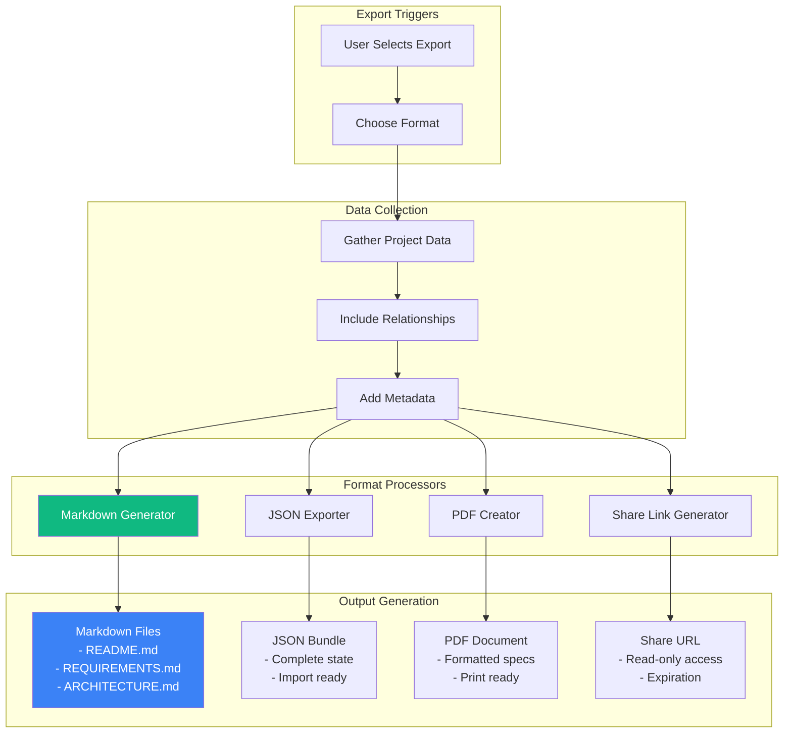
```mermaid
graph TD
    subgraph "Export Triggers"
        A[User Selects Export]
        B[Choose Format]
    end
    
    subgraph "Format Processors"
        C[Markdown Generator]
        D[JSON Exporter]
        E[PDF Creator]
        F[Share Link Generator]
    end
    
    subgraph "Data Collection"
        G[Gather Project Data]
        H[Include Relationships]
        I[Add Metadata]
    end
    
    subgraph "Output Generation"
        J[Markdown Files<br/>- README.md<br/>- REQUIREMENTS.md<br/>- ARCHITECTURE.md]
        K[JSON Bundle<br/>- Complete state<br/>- Import ready]
        L[PDF Document<br/>- Formatted specs<br/>- Print ready]
        M[Share URL<br/>- Read-only access<br/>- Expiration]
    end
    
    A --> B
    B --> G
    G --> H
    H --> I
    
    I --> C --> J
    I --> D --> K
    I --> E --> L
    I --> F --> M
    
    style C fill:#10b981,color:#fff
    style J fill:#3b82f6,color:#fff
```

### 2. Share Link Access Flow

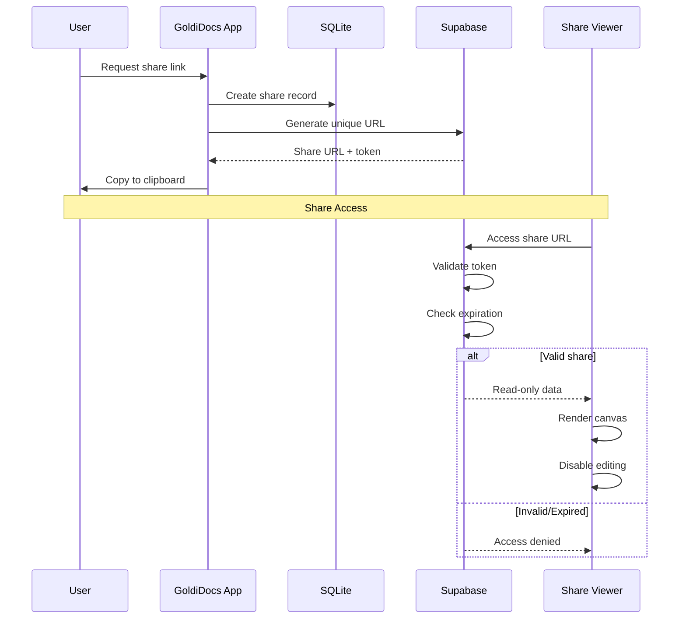
```mermaid
sequenceDiagram
    participant User as User
    participant App as GoldiDocs App
    participant DB as SQLite
    participant Supa as Supabase
    participant Viewer as Share Viewer
    
    User->>App: Request share link
    App->>DB: Create share record
    App->>Supa: Generate unique URL
    Supa-->>App: Share URL + token
    App->>User: Copy to clipboard
    
    Note over User,Viewer: Share Access
    
    Viewer->>Supa: Access share URL
    Supa->>Supa: Validate token
    Supa->>Supa: Check expiration
    
    alt Valid share
        Supa-->>Viewer: Read-only data
        Viewer->>Viewer: Render canvas
        Viewer->>Viewer: Disable editing
    else Invalid/Expired
        Supa-->>Viewer: Access denied
    end
```

## Phase-by-Phase Data Flow

### Phase Flow: Problem → Personas → Pain Points → Solutions

```mermaid
graph TB
    subgraph "Phase 1: Problem Input"
        A1[User Types Problem]
        A2[problem-validation]
        A3[Gold Flash 3x]
        A4[canvas_states v1]
    end
    
    subgraph "Phase 2: Persona Generation"
        B1[generate-personas]
        B2[5 Personas Created]
        B3[Stagger Animation 150ms]
        B4[Highest Pain = Gold]
        B5[canvas_states v2]
        B6[Progress Shows Circles]
    end
    
    subgraph "Phase 3: Pain Points"
        C1[Canvas Slides Left]
        C2[Personas Opacity 0.3]
        C3[generate-pain-points]
        C4[7 Pain Points]
        C5[Attribution Lines]
        C6[canvas_states v3]
    end
    
    subgraph "Phase 4: Solutions"
        D1[generate-solutions]
        D2[User Stories Created]
        D3[Focus Group Session]
        D4[Dot Voting Display]
        D5[Must-Have Features]
        D6[canvas_states v4]
    end
    
    subgraph "Phase 5: Documents"
        E1[generate-product-vision]
        E2[generate-functional-requirements]
        E3[generate-system-architecture]
        E4[generate-data-flow-diagram]
        E5[generate-design-system]
        E6[Drift Detection Active]
    end
    
    A1 --> A2 --> A3 --> A4
    A4 --> B1 --> B2 --> B3 --> B4 --> B5 --> B6
    B5 --> C1 --> C2 --> C3 --> C4 --> C5 --> C6
    C6 --> D1 --> D2 --> D3 --> D4 --> D5 --> D6
    D6 --> E1 --> E2
    E2 --> E3
    E2 --> E4
    E2 --> E5
    E1 --> E6
    
    style A3 fill:#ffd700,color:#000
    style B4 fill:#ffd700,color:#000
    style D3 fill:#9333ea,color:#fff
    style E6 fill:#ef4444,color:#fff
```

## Sidebar Recent Flows Data Flow

```mermaid
sequenceDiagram
    participant User as User
    participant Sidebar as Sidebar Component
    participant RFC as recent_flows_cache
    participant DB as SQLite
    participant PT as progress_tracking
    
    Sidebar->>RFC: Get recent flows
    RFC->>DB: Check cache expiry
    
    alt Cache expired
        RFC->>DB: Query projects
        DB-->>RFC: User's projects
        
        loop For each project
            RFC->>PT: Get progress data
            PT-->>RFC: Step completion status
            RFC->>RFC: Calculate 5 segments
            Note over RFC: 1. Problem ✓
            Note over RFC: 2. Personas ✓  
            Note over RFC: 3. Pain Points ✓
            Note over RFC: 4. Solutions ░
            Note over RFC: 5. Specs ░
        end
        
        RFC->>DB: Update cache
    end
    
    RFC-->>Sidebar: Recent flows data
    
    Sidebar->>Sidebar: Render flow cards
    Note over Sidebar: - 2-line problem text
    Note over Sidebar: - Relative timestamp
    Note over Sidebar: - Progress segments
    
    User->>Sidebar: Click flow card
    Sidebar->>DB: Load project state
    DB-->>Sidebar: canvas_states + react_flow_states
    Sidebar->>Sidebar: Navigate to canvas
```

## Export and Share Link Data Flow

```mermaid
sequenceDiagram
    participant User as User
    participant Modal as Export Modal
    participant IPC as Tauri IPC
    participant Gen as Export Generator
    participant EH as export_history
    participant SL as share_links
    participant Supa as Supabase
    
    User->>Modal: Click Export
    Modal->>Modal: Show format options
    Note over Modal: - Markdown
    Note over Modal: - JSON  
    Note over Modal: - PDF
    Note over Modal: - Share Link
    
    User->>Modal: Select format
    
    alt Markdown Export
        Modal->>IPC: Export markdown
        IPC->>Gen: Generate markdown files
        Gen->>Gen: Create file structure
        Note over Gen: - README.md
        Note over Gen: - requirements.md
        Note over Gen: - architecture.md
        Note over Gen: - All documents
        Gen->>EH: Record export
        Gen-->>User: Download files
    else Share Link
        Modal->>IPC: Create share link
        IPC->>SL: Generate unique token
        IPC->>Supa: Create public link
        Supa-->>IPC: Share URL
        IPC->>SL: Store share config
        Note over SL: - Expiration
        Note over SL: - Permissions
        Note over SL: - Access tracking
        IPC-->>Modal: Copy to clipboard
        Modal-->>User: "Link copied!"
    end
```

## Time Travel with Separated States

```mermaid
sequenceDiagram
    participant User as User
    participant Timeline as Timeline UI
    participant CS as canvas_states
    participant RFS as react_flow_states
    participant Events as langgraph_state_events
    participant UI as Canvas UI
    
    User->>Timeline: View version history
    Timeline->>Events: Get event list
    Events-->>Timeline: Events with metadata
    
    Timeline->>Timeline: Display timeline
    Note over Timeline: Event markers with descriptions
    
    User->>Timeline: Hover over event
    Timeline->>CS: Get version snapshot
    CS-->>Timeline: Historical business state
    
    Timeline->>UI: Preview overlay
    Note over UI: Shows historical state
    Note over UI: Current viewport maintained
    
    User->>Timeline: Double-click to restore
    Timeline->>CS: Set as current version
    CS->>CS: Create new version
    Note over CS: Parent = selected version
    
    CS-->>UI: Update canvas nodes/edges
    Note over UI: Business state changes
    Note over UI: UI state (zoom/pan) unchanged
    
    RFS->>RFS: Viewport remains same
    Note over RFS: User's view preserved
```

## Performance Optimization Strategies

## Monitoring and Diagnostics

### 1. Health Check Flow

```mermaid
graph TD
    subgraph "Health Monitors"
        A[Database Size Monitor]
        B[Sync Queue Monitor]
        C[Conflict Monitor]
        D[Performance Monitor]
    end
    
    subgraph "Metrics"
        E[Storage Usage]
        F[Pending Syncs]
        G[Active Conflicts]
        H[Operation Latency]
    end
    
    subgraph "Alerts"
        I[Storage Warning]
        J[Sync Backlog]
        K[Conflict Count]
        L[Performance Degradation]
    end
    
    A --> E --> I
    B --> F --> J
    C --> G --> K
    D --> H --> L
    
    style I fill:#f59e0b,color:#fff
    style J fill:#ef4444,color:#fff
```

This comprehensive data flow diagram incorporates all aspects of local storage consistency, synchronization, error handling, and performance optimization to ensure a robust and reliable application architecture.