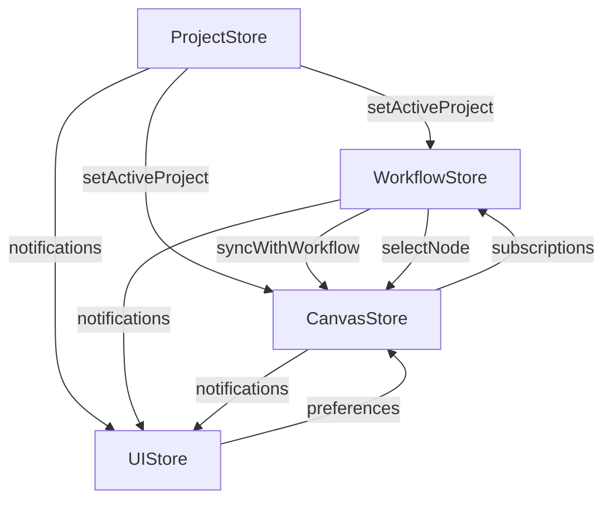

# Store Integration Architecture

## Overview

This application uses a multi-store architecture built with Zustand that maintains clean separation of concerns while enabling efficient cross-store communication. The architecture ensures predictable data flow, centralized user feedback, and reactive visual updates.

## Store Responsibilities

### 1. ProjectStore (`src/stores/projectStore.ts`)
**Domain**: Workspace and project management
- Source of truth for workspace and project data
- Handles user authentication context
- Manages project lifecycle and recent projects
- **Integration Role**: Triggers workflow and canvas loading when projects change

### 2. WorkflowStore (`src/stores/workflowStore.ts`)
**Domain**: Business workflow logic
- Source of truth for problem validation, personas, pain points, solutions, and user stories
- Orchestrates workflow progression through defined steps
- Manages item locking and selection states
- **Integration Role**: Notifies canvas store for visual updates and uses UI store for user feedback

### 3. CanvasStore (`src/stores/canvasStore.ts`)
**Domain**: Visual representation and layout
- Source of truth for React Flow nodes, edges, and viewport state
- Handles animations, layouts, and visual transitions
- Manages node selection and interaction states
- **Integration Role**: Subscribes to workflow changes for reactive updates and responds to UI preferences

### 4. UIStore (`src/stores/uiStore.ts`)
**Domain**: User interface and preferences
- Source of truth for notifications, modals, theme, and layout preferences
- Provides centralized notification system
- Manages feature flags and experimental features
- **Integration Role**: Receives notifications from all stores and influences canvas behavior through preferences

## Communication Patterns

### 1. Direct Method Calls (Immediate Updates)
Used when one store needs to immediately update another store's state.

```typescript
// Example: Persona selection in WorkflowStore
selectPersona: async (personaId) => {
  set({ activePersonaId: personaId })
  
  // Direct calls to other stores
  const canvasStore = useCanvasStore.getState()
  canvasStore.syncWithWorkflow(get())
  canvasStore.selectNode(`persona-${personaId}`)
  
  const uiStore = useUIStore.getState()  
  uiStore.showSuccess('Persona selected')
}
```

**When to use**: Immediate state updates that must happen synchronously.

### 2. Subscription Pattern (Reactive Updates)
Used when a store needs to react to state changes in another store.

```typescript
// Example: Canvas reacting to workflow step changes
useWorkflowStore.subscribe(
  (state) => state.currentStep,
  (currentStep) => {
    const canvasStore = useCanvasStore.getState()
    const workflowState = useWorkflowStore.getState()
    
    // Apply appropriate layout for step
    switch (currentStep) {
      case 'persona_selection':
        canvasStore.applyLayout('hierarchical')
        break
      case 'solution_brainstorming':
        canvasStore.applyLayout('force')
        break
    }
    
    canvasStore.syncWithWorkflow(workflowState)
  }
)
```

**When to use**: Reactive updates that should happen whenever specific state changes occur.

### 3. Notification Pattern (User Feedback)
Centralized user feedback system where all stores use UIStore for notifications.

```typescript
// Example: Error handling in ProjectStore
try {
  const workspace = await createWorkspace(name)
  uiStore.showSuccess('Workspace created', `Created workspace "${name}"`)
} catch (error) {
  uiStore.showError('Failed to create workspace', error.message)
}
```

**When to use**: Any operation that needs to provide user feedback.

### 4. Lazy Loading Pattern (Avoiding Circular Dependencies)
Used when circular dependencies would occur with direct imports.

```typescript
// Example: UI preferences affecting canvas
toggleGrid: () => {
  const newGridEnabled = !get().gridEnabled
  set({ gridEnabled: newGridEnabled })
  
  // Dynamic import to avoid circular dependency
  import('./canvasStore').then(({ useCanvasStore }) => {
    const canvasStore = useCanvasStore.getState()
    canvasStore.markDirty() // Trigger re-render
  })
}
```

**When to use**: When direct imports would create circular dependencies.

## Key Integration Points

### Project Management Flow
```
User opens project → projectStore.setActiveProject()
                 ↓
    workflowStore.loadWorkflowState() + canvasStore.loadCanvasState()
                 ↓
         uiStore.showSuccess("Project opened")
```

### Workflow Progression Flow
```
User advances step → workflowStore.proceedToNextStep()
                  ↓
     canvasStore.syncWithWorkflow() + canvasStore.applyLayout()
                  ↓
          uiStore.showSuccess("Advanced to [step]")
```

### Visual Selection Flow
```
User selects persona → workflowStore.selectPersona()
                    ↓
       canvasStore.selectNode() + canvasStore.syncWithWorkflow()
                    ↓
           uiStore.showSuccess("Persona selected")
                    ↓
Canvas subscription detects change → Visual update
```

### UI Preference Changes
```
User toggles grid → uiStore.toggleGrid()
                 ↓
    canvasStore.markDirty() (via dynamic import)
                 ↓
         Canvas re-renders with new grid setting
```

## Detailed Data Flow Example: Persona Selection

1. **User Action**: User clicks on a persona in the UI
2. **Store Update**: `workflowStore.selectPersona(personaId)` is called
3. **State Change**: WorkflowStore updates `activePersonaId`
4. **Direct Notifications**: 
   - Calls `canvasStore.syncWithWorkflow()` to update visual representation
   - Calls `canvasStore.selectNode()` to highlight the persona node
   - Calls `uiStore.showSuccess()` for user feedback
5. **Subscription Reaction**: CanvasStore subscription detects `activePersonaId` change
6. **Visual Update**: Canvas updates selection state and visual highlighting
7. **User Feedback**: Success notification appears in UI

## Subscription Map

### CanvasStore Subscriptions
- `workflowStore.currentStep` → Apply appropriate layouts and sync workflow
- `workflowStore.activePersonaId` → Update persona node selection
- `workflowStore.selectedSolutionIds` → Update solution node multi-selection
- `canvasStore.projectId` → Load canvas state for new projects
- `canvasStore.isDirty` → Trigger auto-save logic

### Cross-Store Dependencies



## Best Practices

### 1. Store Boundaries
- **Never** directly mutate another store's state
- **Always** use the other store's actions/methods
- **Keep** domain logic within the appropriate store

### 2. Error Handling
- **Always** provide user feedback for async operations
- **Use** try-catch blocks with UIStore notifications
- **Maintain** loading states during async operations

### 3. Subscription Management
- **Place** subscriptions outside the store definition to avoid recreation
- **Use** specific state selectors to minimize unnecessary re-renders
- **Clean up** subscriptions when needed (though Zustand handles this automatically)

### 4. Circular Dependencies
- **Use** dynamic imports when circular dependencies occur
- **Consider** extracting shared types to a separate file
- **Restructure** if too many circular dependencies appear

## Testing Considerations

When testing store integration:

1. **Mock** other stores when testing individual store logic
2. **Test** subscription behavior separately from direct method calls
3. **Verify** notification calls without depending on UI implementation
4. **Use** integration tests for complete data flow scenarios

## Performance Considerations

1. **Debounce** auto-save operations (implemented in CanvasStore)
2. **Use** specific selectors in subscriptions to avoid unnecessary updates
3. **Batch** related state updates when possible
4. **Consider** lazy loading for expensive operations

## Migration and Maintenance

When adding new integration points:

1. **Document** the new communication pattern
2. **Update** this documentation
3. **Consider** impact on existing subscriptions
4. **Test** both direct and reactive update paths
5. **Ensure** proper error handling and user feedback

---

*Last updated: [Current Date]*
*Related files: `src/stores/*.ts`, `src/stores/index.ts`* 